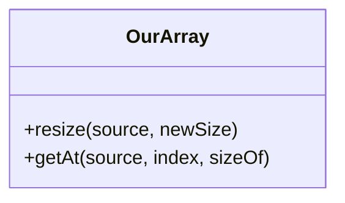

# 📚 Table of Contents

- [📚 Table of Contents](#-table-of-contents)
- [⚡ Features](#-features)
- [🎯 Project Overview](#-project-overview)
- [⚡ Features](#-features-1)
- [📊 Diagrams](#-diagrams)
- [🔧 Technologies Used](#-technologies-used)
- [🎓 Learning Objectives](#-learning-objectives)
- [📁 File Structure](#-file-structure)
- [🎯 Practice Exercises](#-practice-exercises)
- [🎓 Learning Objectives](#-learning-objectives-1)
- [📖 Additional Resources](#-additional-resources)
- [🚀 Getting Started](#-getting-started)
- [👨‍💻 Author](#-author)
- [📝 Key Concepts](#-key-concepts)
- [🔍 Common Questions](#-common-questions)
- [🎯 Practice Exercises](#-practice-exercises-1)
- [📖 Additional Resources](#-additional-resources-1)
- [👨‍💻 Author](#-author-1)
- [📄 License](#-license)

# ⚡ Features

- Manual array resizing (simulates C++ `memcpy` and uninitialized memory)
- Safe element access with bounds checking
- Simulated pointer arithmetic (for educational purposes)
- TypeScript generics for type safety

# 🎯 Project Overview

This project demonstrates a **basic array implementation from scratch in TypeScript**. It is designed for beginners to understand how arrays work under the hood, including how elements are stored, accessed, and manipulated without relying on built-in array methods.

---

# ⚡ Features

- Custom array class with manual element management
- Methods for adding, removing, and accessing elements
- TypeScript for type safety and clarity
- Beginner-friendly code structure



# 📊 Diagrams

```mermaid
# ⚡ Operations / Functions / API

      +pop()
      +delete(index)
    }
```

---

# 🔧 Technologies Used

- TypeScript
- Node.js (for running code)
- No external libraries required

---

```typescript
const arr = [4654, 921, 762];
const our = new OurArray();

// Resize the array to length 5
const resized = our.resize(arr, 5);
console.log(resized); // [4654, 921, 762, undefined, undefined]

// Get an element at index 1
const item = our.getAt(resized, 1, 4); // 4 bytes = sizeof(int)
console.log(item); // 921
```

To run:

```powershell
# Compile TypeScript
npm install -g typescript
cd a:\MyGitHub2024\data-structures-from-scratch\01-Array-Implementation
tsc index.ts
# Run with Node.js
node index.js
```

Assuming a typical implementation, the following methods are available:

| Method       | Description          | Complexity |
| ------------ | -------------------- | ---------- |
| `get(index)` | Get element at index | O(1)       |
| `push(item)` | Add element to end   | O(1)       |

```
01-Array-Implementation/
│  index.ts        # Contains OurArray class and usage example
```

| `delete(index)` | Remove element at index | O(n) |

---

# 🎓 Learning Objectives

- Understand manual array resizing and memory simulation
- Learn safe element access and bounds checking
- See how low-level concepts map to high-level languages
- Practice TypeScript generics and basic OOP

```typescript
const arr = new MyArray();
arr.push(10);
arr.push(20);
console.log(arr.get(0)); // 10
arr.delete(0);
console.log(arr.get(0)); // 20
```

````powershell
1. **Clone the repository**
   ```powershell
   git clone <your-repo-url>
   cd a:\MyGitHub2024\data-structures-from-scratch\01-Array-Implementation
````

2. **Install Node.js and TypeScript**
   - Download from [Node.js](https://nodejs.org/)
   - Install TypeScript globally:
     ```powershell
     npm install -g typescript
     ```
3. **Compile and run**
   ```powershell
   tsc index.ts
   node index.js
   ```
   To run:

```powershell
# 📝 Key Concepts

- Array resizing and memory allocation
- Pointer arithmetic simulation
- TypeScript generics
- Defensive programming (bounds checking)
```

---

# 📁 File Structure

```
# 🔍 Common Questions

- **Why use `undefined` for new slots?**
  - To simulate uninitialized memory in low-level languages.
- **What happens if I access out-of-bounds?**
  - `getAt` returns `undefined` for safety.
- **Is this how JavaScript arrays work internally?**
  - No, this is for educational purposes only.
01-Array-Implementation/
│  index.ts        # Main array implementation
```

# 🎯 Practice Exercises

- Add a method to insert at a specific index
- Implement a method to remove an element
- Extend to support deep copying arrays

# 🎓 Learning Objectives

- Understand how arrays work internally

# 📖 Additional Resources

- [MDN Web Docs: Arrays](https://developer.mozilla.org/en-US/docs/Web/JavaScript/Reference/Global_Objects/Array)
- [TypeScript Handbook](https://www.typescriptlang.org/docs/)
- [Pointer Arithmetic in C++](https://www.geeksforgeeks.org/pointer-arithmetic-in-c-c-with-examples/)

---

# 🚀 Getting Started

# 👨‍💻 Author

- [Your Name]

1. **Clone the repository**
   ```powershell
   git clone <your-repo-url>
   cd 01-Array-Implementation
   ```

MIT License. This project is for educational purposes.

````
2. **Install Node.js and TypeScript**
   - Download from [Node.js](https://nodejs.org/)
   - Install TypeScript globally:
     ```powershell
     npm install -g typescript
     ```
3. **Compile and run**
   ```powershell
   tsc index.ts
   node index.js
````

---

# 📝 Key Concepts

- Array memory management
- Indexing and element access
- Manual resizing and shifting
- Time complexity of operations

---

# 🔍 Common Questions

- **Why implement arrays from scratch?**
  - To understand how built-in data structures work and their limitations.
- **What is the time complexity of deleting an element?**
  - O(n), because elements must be shifted.

---

# 🎯 Practice Exercises

- Add a method to insert at a specific index
- Implement a method to find an element
- Extend to support generic types

---

# 📖 Additional Resources

- [MDN Web Docs: Arrays](https://developer.mozilla.org/en-US/docs/Web/JavaScript/Reference/Global_Objects/Array)
- [TypeScript Handbook](https://www.typescriptlang.org/docs/)
- [Big O Notation](https://www.geeksforgeeks.org/analysis-of-algorithms-set-1-asymptotic-analysis/)

---

# 👨‍💻 Author

- [Your Name]

---

# 📄 License

MIT License. This project is for educational purposes.
