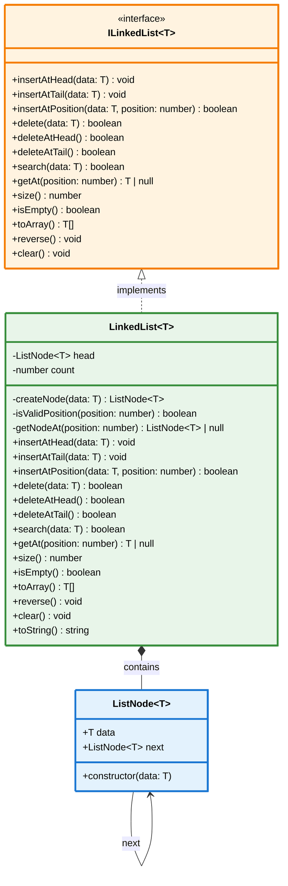

# Singly Linked List - Class Diagram

## Diagram Explanation

### Classes and Relationships

1. **ListNode&lt;T&gt;** - Represents a single node in the linked list

   - 🔵 **Blue background** - Data structure component
   - `data`: The value stored in the node
   - `next`: Reference to the next node (or null)

2. **ILinkedList&lt;T&gt;** - Interface defining the contract for linked list operations

   - 🟠 **Orange background** - Interface/Contract
   - Defines all public methods that a linked list implementation must provide

3. **LinkedList&lt;T&gt;** - Concrete implementation of the singly linked list
   - 🟢 **Green background** - Implementation class
   - **Private fields:**
     - `head`: Reference to the first node
     - `count`: Number of nodes in the list
   - **Private methods:**
     - `createNode()`: Factory method for creating nodes
     - `isValidPosition()`: Validates position boundaries
     - `getNodeAt()`: Internal helper to traverse to a specific position
   - **Public methods:** All interface methods plus `toString()`

### Relationships

- **Implementation** (`<|..`): Dashed line with hollow triangle - `LinkedList` implements `ILinkedList` interface
- **Composition** (`*--`): Solid line with filled diamond - `LinkedList` contains `ListNode` objects (strong ownership)
- **Association** (`-->`): Simple arrow - `ListNode` references itself (next pointer)

### Relationship Lines Legend

| Symbol  | Name           | Meaning              | Example                           |
| ------- | -------------- | -------------------- | --------------------------------- |
| `<\|--` | Inheritance    | "is-a" relationship  | Dog extends Animal                |
| `<\|..` | Implementation | Implements interface | LinkedList implements ILinkedList |
| `*--`   | Composition    | "has-a" (strong)     | LinkedList contains ListNodes     |
| `o--`   | Aggregation    | "has-a" (weak)       | Department has Employees          |
| `-->`   | Association    | References/uses      | ListNode points to next ListNode  |
| `..>`   | Dependency     | Temporary use        | Method uses parameter             |

### Time Complexities

| Operation          | Complexity |
| ------------------ | ---------- |
| insertAtHead()     | O(1)       |
| insertAtTail()     | O(n)       |
| insertAtPosition() | O(n)       |
| delete()           | O(n)       |
| deleteAtHead()     | O(1)       |
| deleteAtTail()     | O(n)       |
| search()           | O(n)       |
| getAt()            | O(n)       |
| reverse()          | O(n)       |

---

## Visual Key

🔵 **ListNode (Blue)** - Basic building block  
🟠 **ILinkedList (Orange)** - Contract/Interface  
🟢 **LinkedList (Green)** - Main implementation

**Relationship arrows are now more visible with:**

- Thicker borders (3px)
- Contrasting background colors
- Black text for readability
