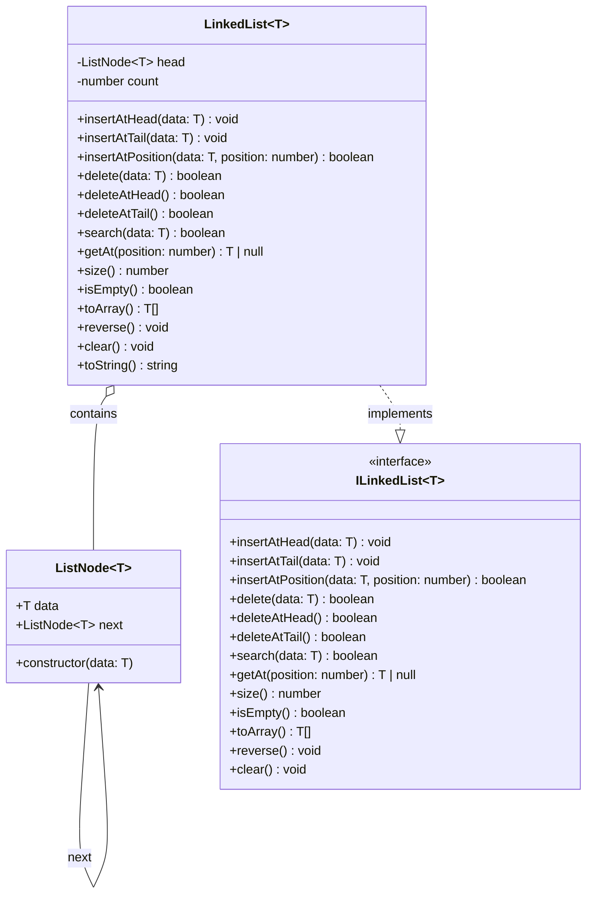

# 📚 Singly Linked List in TypeScript

---

## 📚 Table of Contents

- [📚 Singly Linked List in TypeScript](#-singly-linked-list-in-typescript)
  - [📚 Table of Contents](#-table-of-contents)
  - [🎯 Project Overview](#-project-overview)
  - [⚡ Features](#-features)
  - [📊 Diagrams](#-diagrams)
  - [🔧 Technologies Used](#-technologies-used)
  - [⚡ Operations / Functions](#-operations--functions)
  - [💡 Usage Examples](#-usage-examples)
  - [📁 File Structure](#-file-structure)
  - [🎓 Learning Objectives](#-learning-objectives)
  - [🚀 Getting Started](#-getting-started)
    - [Prerequisites](#prerequisites)
    - [Installation \& Run](#installation--run)
  - [📝 Key Concepts](#-key-concepts)
  - [🔍 Common Questions](#-common-questions)
  - [🎯 Practice Exercises](#-practice-exercises)
  - [📖 Additional Resources](#-additional-resources)
  - [👨‍💻 Author](#-author)
  - [📄 License](#-license)

---

## 🎯 Project Overview

This project provides a clean, generic implementation of a **Singly Linked List** in TypeScript. It demonstrates all standard operations, is easy to read, and is ideal for learning, interviews, or as a base for more advanced data structures.

---

## ⚡ Features

- TypeScript generics (`LinkedList<T>`)
- Insert at head, tail, or any position
- Delete by value, at head, or at tail
- Search, get, reverse, clear, convert to array
- Well-commented and beginner-friendly
- Demo function for quick testing

---

## 📊 Diagrams



---

## 🔧 Technologies Used

- TypeScript (no dependencies)

---

## ⚡ Operations / Functions

| Method                        | Description                      | Complexity |
| ----------------------------- | -------------------------------- | ---------- |
| `insertAtHead(data)`          | Insert at the beginning          | O(1)       |
| `insertAtTail(data)`          | Insert at the end                | O(n)       |
| `insertAtPosition(data, pos)` | Insert at any position           | O(n)       |
| `delete(data)`                | Delete first occurrence of value | O(n)       |
| `deleteAtHead()`              | Delete first node                | O(1)       |
| `deleteAtTail()`              | Delete last node                 | O(n)       |
| `search(data)`                | Check if value exists            | O(n)       |
| `getAt(pos)`                  | Get value at position            | O(n)       |
| `size()`                      | Number of elements               | O(1)       |
| `isEmpty()`                   | Is the list empty?               | O(1)       |
| `toArray()`                   | Convert to array                 | O(n)       |
| `reverse()`                   | Reverse the list in-place        | O(n)       |
| `clear()`                     | Remove all elements              | O(1)       |
| `toString()`                  | String representation            | O(n)       |

---

## 💡 Usage Examples

```typescript
const list = new LinkedList<number>();
list.insertAtHead(3); // [3]
list.insertAtHead(2); // [2,3]
list.insertAtTail(4); // [2,3,4]
list.insertAtPosition(5, 2); // [2,3,5,4]
console.log(list.toString()); // [2 -> 3 -> 5 -> 4]
console.log(list.search(5)); // true
console.log(list.getAt(2)); // 5
list.delete(3); // [2,5,4]
list.reverse(); // [4,5,2]
list.clear(); // []
```

To run the demo, uncomment the last line in `index.ts`:

```typescript
demonstrateLinkedList();
```

---

## 📁 File Structure

```
02-Singly Linked List/
├── index.ts         # Main singly linked list implementation
├── diagram.md       # Mermaid class diagram (optional)
├── README.md        # Project documentation
```

---

## 🎓 Learning Objectives

- Understand how singly linked lists work
- Learn to implement linked list operations from scratch
- Practice TypeScript generics and OOP
- Analyze time complexity of list operations
- Prepare for coding interviews and data structure questions

---

## 🚀 Getting Started

### Prerequisites

- Node.js and npm
- TypeScript installed globally (`npm install -g typescript`)

### Installation & Run

```powershell
# Clone the repo or copy the files
cd "02-Singly Linked List"

# Compile TypeScript (if needed)
tsc index.ts

# Run with ts-node (recommended for quick testing)
npx ts-node index.ts
```

---

## 📝 Key Concepts

- **Linked List**: Sequence of nodes, each pointing to the next
- **Node**: Contains data and reference to next node
- **Head**: First node in the list
- **Tail**: Last node (next is null)
- **Insertion/Deletion**: O(1) at head, O(n) at tail/position
- **Traversal**: Iterating through nodes
- **Reversal**: Changing direction of links

---

## 🔍 Common Questions

**Q: Why use a linked list instead of an array?**  
A: Linked lists allow O(1) insertions/deletions at the head and dynamic memory usage, but have slower random access.

**Q: How do you reverse a linked list?**  
A: By iteratively changing each node’s `next` pointer to point to the previous node.

**Q: What’s the difference between singly and doubly linked lists?**  
A: Doubly linked lists have both `next` and `prev` pointers, allowing bidirectional traversal.

---

## 🎯 Practice Exercises

- Implement a method to remove all occurrences of a value
- Add a method to find the middle element
- Implement a doubly linked list (see `index2.ts`)
- Add iterator support for `for...of` loops

---

## 📖 Additional Resources

- [TypeScript Docs](https://www.typescriptlang.org/docs/)
- [Linked List Wikipedia](https://en.wikipedia.org/wiki/Linked_list)
- [Mermaid Diagrams](https://mermaid.js.org/)
- [GeeksforGeeks: Linked List](https://www.geeksforgeeks.org/data-structures/linked-list/)
- [MIT OpenCourseWare: Linked Lists](https://ocw.mit.edu/courses/6-006-introduction-to-algorithms-fall-2011/resources/lecture-3-linked-lists/)

---

## 👨‍💻 Author

**Your Name**  
GitHub: [your-github](https://github.com/your-github)  
Email: your.email@example.com

---

## 📄 License

MIT License.  
This project is for educational purposes.

---
