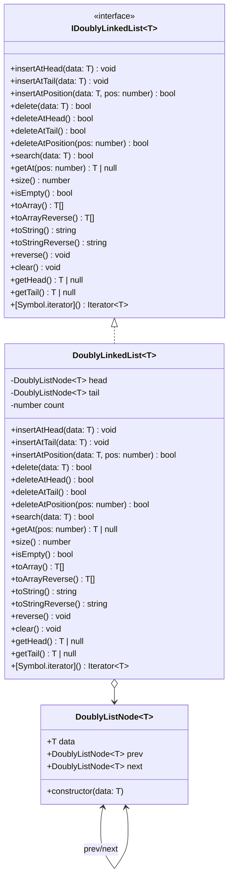

---

### 🔑 Key Points

- `DoublyListNode<T>` has **`prev`** and **`next`** (bidirectional).
- `IDoublyLinkedList<T>` defines **all public operations**.
- `DoublyLinkedList<T>` **implements the interface** and manages:

  - `head`, `tail`, and `count`.
  - Provides **forward + reverse traversal**.

- Node relationships are **bidirectional** (`<-->` in Mermaid).

---

### 📊 Time Complexity Table

| Operation                | Complexity |
| ------------------------ | ---------- |
| Insert at head/tail      | O(1)       |
| Insert at position       | O(n)       |
| Delete at head/tail      | O(1)       |
| Delete at position       | O(n)       |
| Delete by value          | O(n)       |
| Search                   | O(n)       |
| Get at position          | O(n)       |
| Reverse (in-place)       | O(n)       |
| Size / isEmpty / Clear   | O(1)       |
| Traversal (toArray etc.) | O(n)       |

---
