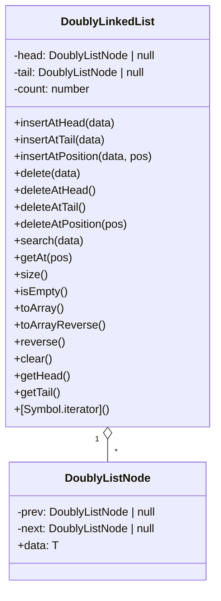

# Doubly Linked List in TypeScript

## 📚 Table of Contents

- [Doubly Linked List in TypeScript](#doubly-linked-list-in-typescript)
  - [📚 Table of Contents](#-table-of-contents)
  - [🎯 Project Overview](#-project-overview)
  - [⚡ Features](#-features)
  - [📊 Diagrams](#-diagrams)
    - [Doubly Linked List Structure (Mermaid)](#doubly-linked-list-structure-mermaid)
  - [🔧 Technologies Used](#-technologies-used)
  - [⚡ Operations / Functions / API](#-operations--functions--api)
    - [Main Methods](#main-methods)
  - [💡 Usage Examples](#-usage-examples)
    - [Run Demo](#run-demo)
    - [Example Code](#example-code)
  - [� File Structure](#-file-structure)
  - [🎓 Learning Objectives](#-learning-objectives)
  - [� Getting Started](#-getting-started)
    - [Prerequisites](#prerequisites)
    - [Installation](#installation)
    - [Running](#running)
  - [📝 Key Concepts](#-key-concepts)
  - [🔍 Common Questions](#-common-questions)
  - [🎯 Practice Exercises](#-practice-exercises)
  - [📖 Additional Resources](#-additional-resources)
  - [👨‍💻 Author](#-author)
  - [📄 License](#-license)

---

## 🎯 Project Overview

This project provides a clean, well-documented implementation of a **Doubly Linked List** in TypeScript. It demonstrates how to build a classic data structure from scratch, supporting efficient insertions and deletions at both ends, bidirectional traversal, and a rich set of operations. The code is beginner-friendly and ideal for learning, interview prep, or as a foundation for more advanced data structures.

---

## ⚡ Features

- O(1) insert/delete at head and tail
- O(n) insert/delete at arbitrary position
- Forward and reverse traversal
- Search, getAt, size, isEmpty, clear, reverse (in-place)
- Iteration support via `for...of`
- Easy-to-read code with comments and demo usage

---

## 📊 Diagrams

### Doubly Linked List Structure (Mermaid)



---

## 🔧 Technologies Used

- **TypeScript** (strictly typed, modern JS superset)
- No external dependencies
- Node.js (for running demo)

---

## ⚡ Operations / Functions / API

### Main Methods

| Method                      | Description                 | Complexity |
| --------------------------- | --------------------------- | ---------- |
| insertAtHead(data)          | Insert at head              | O(1)       |
| insertAtTail(data)          | Insert at tail              | O(1)       |
| insertAtPosition(data, pos) | Insert at position          | O(n)       |
| delete(data)                | Delete first occurrence     | O(n)       |
| deleteAtHead()              | Delete head                 | O(1)       |
| deleteAtTail()              | Delete tail                 | O(1)       |
| deleteAtPosition(pos)       | Delete at position          | O(n)       |
| search(data)                | Check if value exists       | O(n)       |
| getAt(pos)                  | Get value at position       | O(n)       |
| size()                      | Number of elements          | O(1)       |
| isEmpty()                   | Is list empty               | O(1)       |
| toArray()                   | Get values in forward order | O(n)       |
| toArrayReverse()            | Get values in reverse order | O(n)       |
| reverse()                   | Reverse list in-place       | O(n)       |
| clear()                     | Remove all elements         | O(1)       |
| getHead()                   | Get head value              | O(1)       |
| getTail()                   | Get tail value              | O(1)       |
| [Symbol.iterator]()         | Iterate with `for...of`     | O(n)       |

---

## 💡 Usage Examples

### Run Demo

```bash
node index.js
# or with ts-node
ts-node index.ts
```

### Example Code

```typescript
const list = new DoublyLinkedList<number>();
list.insertAtHead(2); // [2]
list.insertAtHead(1); // [1,2]
list.insertAtTail(3); // [1,2,3]
list.insertAtTail(5); // [1,2,3,5]
list.insertAtPosition(4, 3); // [1,2,3,4,5]
console.log(list.toString()); // [1 <-> 2 <-> 3 <-> 4 <-> 5]
list.delete(2); // [1,3,4,5]
list.reverse(); // [5,4,3,1]
for (const value of list) {
  console.log(value);
}
```

---

## � File Structure

```
03-Doubley Linked List/
├── index.ts      # Main implementation and demo
├── readme.md     # Project documentation
```

---

## 🎓 Learning Objectives

- Understand how doubly linked lists work
- Learn to implement classic data structures in TypeScript
- Practice OOP, generics, and iteration protocols
- Explore bidirectional traversal and efficient mutations
- Prepare for coding interviews and technical assessments

---

## � Getting Started

### Prerequisites

- Node.js & npm
- TypeScript (optional, for type checking)

### Installation

1. Clone the repo:
   ```bash
   git clone <your-repo-url>
   cd data-structures-from-scratch/03-Doubley Linked List
   ```
2. (Optional) Install TypeScript:
   ```bash
   npm install -g typescript ts-node
   ```

### Running

```bash
ts-node index.ts   # Run demo with TypeScript
# or
node index.js      # After compiling to JS
```

---

## 📝 Key Concepts

- **Doubly Linked List**: Each node points to both previous and next
- **O(1) Operations**: Fast insert/delete at ends
- **Bidirectional Traversal**: Move forward and backward
- **In-place Reversal**: Reverse the list efficiently
- **TypeScript Generics**: Type-safe, reusable code

---

## 🔍 Common Questions

**Q: Why use a doubly linked list over a singly linked list?**
A: Doubly linked lists allow efficient backward traversal and easier node deletion.

**Q: What is the time complexity of reversing the list?**
A: O(n), as each node's pointers are swapped.

**Q: How is iteration implemented?**
A: Via the `[Symbol.iterator]` method, enabling `for...of` loops.

---

## 🎯 Practice Exercises

- Add a method to remove all occurrences of a value
- Implement a sorted insert method
- Add support for custom comparison functions
- Write unit tests for all operations

---

## 📖 Additional Resources

- [MDN: Linked List](https://developer.mozilla.org/en-US/docs/Glossary/Linked_list)
- [TypeScript Handbook](https://www.typescriptlang.org/docs/)
- [Wikipedia: Doubly Linked List](https://en.wikipedia.org/wiki/Doubly_linked_list)

---

## 👨‍💻 Author

- [Your Name] (replace with your info)

---

## 📄 License

MIT License. This project is for educational purposes.
