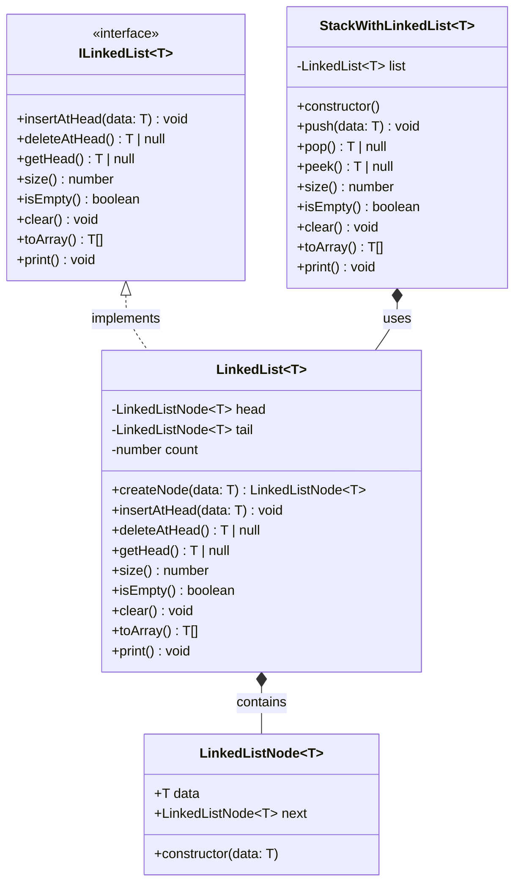
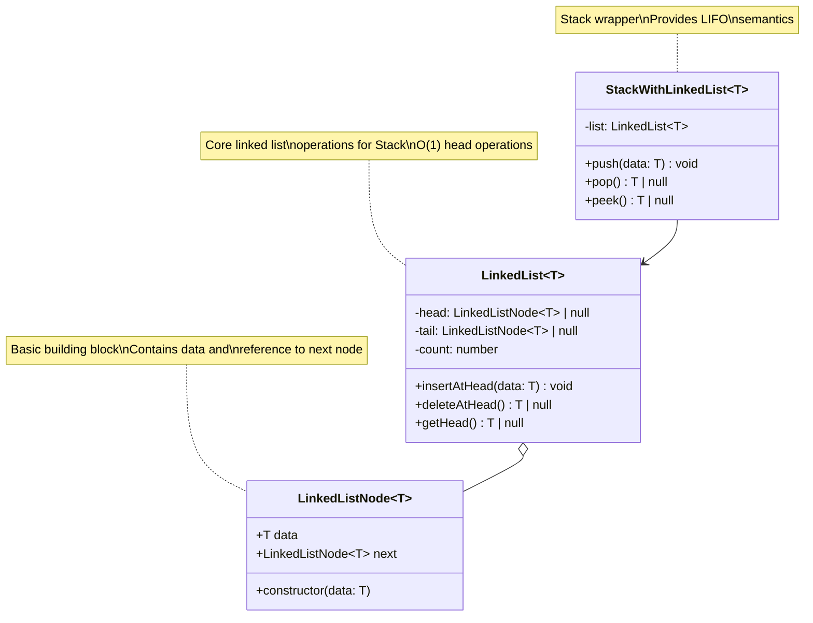
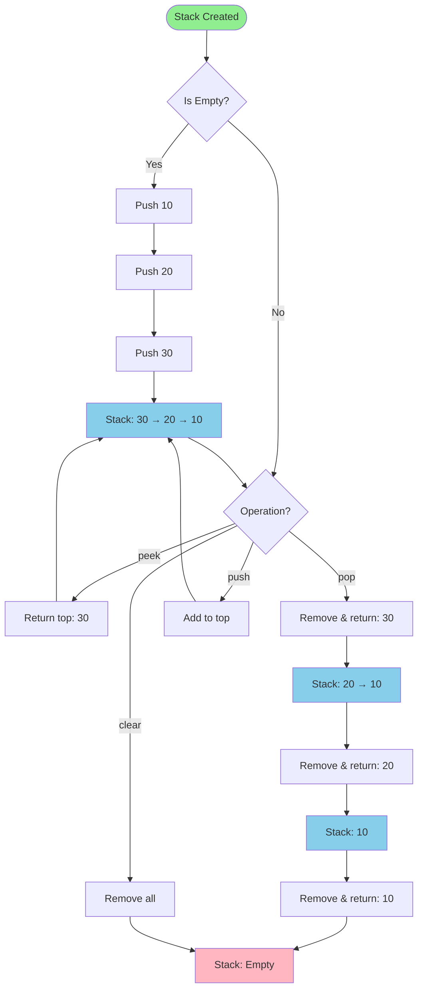
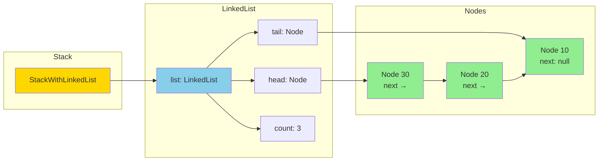

# Stack Implementation with Linked List

A complete implementation of a Stack data structure using a Linked List in TypeScript, designed for beginners learning data structures.

## 📚 Table of Contents

- [What is a Stack?](#what-is-a-stack)
- [Why Use Linked List?](#why-use-linked-list)
- [Class Diagrams](#class-diagrams)
- [Operations & Complexity](#operations--complexity)
- [Usage Examples](#usage-examples)
- [File Structure](#file-structure)

---

## 🎯 What is a Stack?

A **Stack** is a linear data structure that follows the **LIFO (Last-In-First-Out)** principle.

Think of it like:

- A stack of plates 🍽️
- A stack of books 📚
- Browser back button history

**Key Principle**: The last element added is the first one to be removed.

```
Push 10, 20, 30:
    [30]  ← Top (last in, first out)
    [20]
    [10]  ← Bottom

Pop returns 30, then 20, then 10
```

---

## 🔗 Why Use Linked List?

| Feature         | Array-based Stack         | Linked List Stack   |
| --------------- | ------------------------- | ------------------- |
| **Size**        | Fixed (or needs resizing) | Dynamic             |
| **Push/Pop**    | O(1)                      | O(1) ✅             |
| **Memory**      | Contiguous                | Non-contiguous      |
| **Resize Cost** | O(n) when full            | No resize needed ✅ |

**Linked List advantages for Stack:**

- ✅ No fixed capacity limit
- ✅ No expensive resize operations
- ✅ Efficient memory usage (grow/shrink as needed)
- ✅ All operations are O(1)

---

## 📊 Class Diagrams

### Overall Architecture



### Detailed Class Relationships



### Stack Operations Flow



### Memory Representation



---

## ⚡ Operations & Complexity

### Stack Operations

| Operation    | Description                   | Time Complexity | Space Complexity |
| ------------ | ----------------------------- | --------------- | ---------------- |
| `push(data)` | Add element to top            | O(1)            | O(1)             |
| `pop()`      | Remove & return top element   | O(1)            | O(1)             |
| `peek()`     | View top element (no removal) | O(1)            | O(1)             |
| `isEmpty()`  | Check if stack is empty       | O(1)            | O(1)             |
| `size()`     | Get number of elements        | O(1)            | O(1)             |
| `clear()`    | Remove all elements           | O(1)            | O(1)             |
| `toArray()`  | Convert to array              | O(n)            | O(n)             |
| `print()`    | Display stack                 | O(n)            | O(n)             |

### LinkedList Operations (Internal)

| Operation            | Description           | Time Complexity |
| -------------------- | --------------------- | --------------- |
| `insertAtHead(data)` | Insert at beginning   | O(1)            |
| `deleteAtHead()`     | Delete from beginning | O(1)            |
| `getHead()`          | Get first element     | O(1)            |

---

## 💡 Usage Examples

### Basic Operations

```typescript
import { StackWithLinkedList } from "./stack";

const stack = new StackWithLinkedList<number>();

// Push elements
stack.push(10);
stack.push(20);
stack.push(30);
// Stack: [30] -> [20] -> [10]

// Peek (view top without removing)
console.log(stack.peek()); // 30
console.log(stack.size()); // 3 (peek doesn't remove)

// Pop elements
console.log(stack.pop()); // 30
console.log(stack.pop()); // 20
// Stack: [10]

console.log(stack.isEmpty()); // false
```

### Edge Cases

```typescript
const stack = new StackWithLinkedList<number>();

// Pop from empty stack
console.log(stack.pop()); // null
console.log(stack.peek()); // null

// Check empty
console.log(stack.isEmpty()); // true

// Add and clear
stack.push(1);
stack.push(2);
stack.clear();
console.log(stack.isEmpty()); // true
```

### Generic Types

```typescript
// Stack of strings
const stringStack = new StackWithLinkedList<string>();
stringStack.push("First");
stringStack.push("Second");
console.log(stringStack.pop()); // "Second"

// Stack of objects
interface Task {
  id: number;
  name: string;
}

const taskStack = new StackWithLinkedList<Task>();
taskStack.push({ id: 1, name: "Task 1" });
taskStack.push({ id: 2, name: "Task 2" });
```

---

## 📁 File Structure

```
04-stack with Linked List/
├── linkedList.ts      # LinkedList implementation (internal)
├── stack.ts          # Stack implementation (main)
├── index.ts          # Usage examples and demos
└── README.md         # This file
```

### File Descriptions

#### `linkedList.ts`

- **LinkedListNode**: Basic node with data and next pointer
- **ILinkedList**: Interface defining linked list operations
- **LinkedList**: Implementation optimized for head operations
- Used internally by Stack (not exposed to users)

#### `stack.ts`

- **StackWithLinkedList**: Main Stack class
- Wraps LinkedList to provide LIFO semantics
- Provides standard stack operations (push, pop, peek)

#### `index.ts`

- Comprehensive examples demonstrating all operations
- Edge cases and best practices
- Different data types usage

---

## 🎓 Learning Objectives

After studying this implementation, you should understand:

1. ✅ **Stack LIFO Principle**: Last-In-First-Out behavior
2. ✅ **Linked List Advantage**: Dynamic size vs fixed arrays
3. ✅ **Time Complexity**: Why all operations are O(1)
4. ✅ **Encapsulation**: How Stack wraps LinkedList
5. ✅ **Generics**: Type-safe implementation with `<T>`
6. ✅ **Edge Cases**: Empty stack handling
7. ✅ **Memory Management**: Head/tail pointer updates

---

## 🚀 Running the Examples

```bash
# Compile TypeScript
tsc

# Run the examples
node index.js
```

Or use `ts-node`:

```bash
ts-node index.ts
```

---

## 📝 Key Concepts Summary

### LIFO (Last-In-First-Out)

```
Push Order: 10 → 20 → 30
Pop Order:  30 → 20 → 10
```

### Why Head Operations?

- **Push**: Insert at head = O(1)
- **Pop**: Delete from head = O(1)
- **Peek**: Read head = O(1)

If we used tail:

- Delete from tail = O(n) ❌ (need to update previous node)

### Encapsulation

```
User → Stack (LIFO interface) → LinkedList (internal) → Nodes
```

Users don't need to know about linked list internals!

---

## 🔍 Common Interview Questions

1. **Why use linked list over array for stack?**

   - No fixed size limit
   - No expensive resize operations
   - O(1) guaranteed for all operations

2. **What's the difference between peek() and pop()?**

   - `peek()`: Returns top element without removing it
   - `pop()`: Returns AND removes top element

3. **What happens when popping from empty stack?**

   - Returns `null` (graceful handling)
   - Alternative: could throw an error

4. **Why do we maintain tail in LinkedList?**
   - Not used for stack operations
   - Kept for potential future queue implementation
   - Could be removed for stack-only use

---

## 📚 Related Data Structures

- **Queue**: FIFO (First-In-First-Out) - uses head and tail
- **Deque**: Double-ended queue - both ends accessible
- **Array-based Stack**: Fixed/dynamic array implementation

---

## 🎯 Practice Exercises

1. Implement a `reverse()` method to reverse stack elements
2. Create a method to find the minimum element in O(1)
3. Implement a method to check if parentheses are balanced
4. Create a stack that supports `getMiddle()` operation

---

## 📖 Additional Resources

- [Visualize Stack Operations](https://visualgo.net/en/list)
- [Big O Notation Guide](https://www.bigocheatsheet.com/)
- [TypeScript Generics](https://www.typescriptlang.org/docs/handbook/2/generics.html)

---
