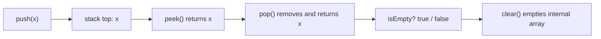
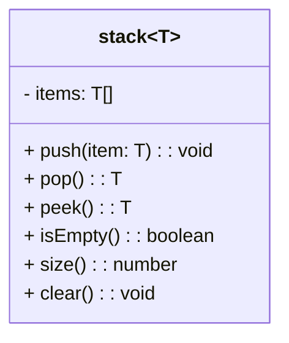

## 📚 Table of Contents

- [📚 Table of Contents](#-table-of-contents)
- [🎯 Project Overview](#-project-overview)
- [⚡ Features](#-features)
- [📊 Diagrams](#-diagrams)
- [🔧 Technologies Used](#-technologies-used)
- [⚡ Operations / API](#-operations--api)
- [💡 Usage Examples](#-usage-examples)
- [📁 File Structure](#-file-structure)
- [🎓 Learning Objectives](#-learning-objectives)
- [🚀 Getting Started](#-getting-started)
- [📝 Key Concepts](#-key-concepts)
- [🔍 Common Questions](#-common-questions)
- [🎯 Practice Exercises](#-practice-exercises)

## 🎯 Project Overview

This small repository implements a generic Stack data structure using a TypeScript array under the hood. It demonstrates a clean, beginner-friendly implementation of the classic LIFO (Last In, First Out) stack and a tiny example runner that shows how to use it.

The code is intentionally minimal so learners can focus on core stack operations and TypeScript generics.

## ⚡ Features

- Generic, type-safe Stack class (`stack<T>`).
- Common stack operations: `push`, `pop`, `peek`, `isEmpty`, `size`, and `clear`.
- Small runnable example in `index.ts` that demonstrates the API.
- Beginner-friendly TypeScript code with clear method responsibilities.

## 📊 Diagrams

Below is a simple flow diagram showing typical use of the stack (push → peek → pop → clear).



Class-style diagram (conceptual):



## 🔧 Technologies Used

- TypeScript (strict-optional typing recommended)
- Node.js (for running the example)
- Optional dev tools: `ts-node`, `typescript` (for convenience)

## ⚡ Operations / API

This repo exposes a single class exported as default from `stack.ts`.

- `push(item: T): void` — add an item to the top of the stack. Time complexity: O(1)
- `pop(): T` — remove and return the top item. Throws if the stack is empty. Time complexity: O(1)
- `peek(): T` — return the top item without removing it. Throws if the stack is empty. Time complexity: O(1)
- `isEmpty(): boolean` — true if the stack contains no items. Time complexity: O(1)
- `size(): number` — number of items in the stack. Time complexity: O(1)
- `clear(): void` — empties the stack. Time complexity: O(1) (reassigns internal array)

## 💡 Usage Examples

Example usage is provided in `index.ts`. Here are the important parts and how to run them.

Code example (from `index.ts`):

```ts
import stack from "./stack";

const myStack = new stack<number>();
myStack.push(10);
myStack.push(20);
console.log(`Top element is: ${myStack.peek()}`);
console.log(`Stack size is: ${myStack.size()}`);
console.log(`Popped element is: ${myStack.pop()}`);
console.log(`Is stack empty? ${myStack.isEmpty()}`);
myStack.clear();
console.log(`Is stack empty after clear? ${myStack.isEmpty()}`);
```

Expected output (approximate):

```
Pushed: 10
Pushed: 20
Top element is: 20
Stack size is: 2
Popped element is: 20
Is stack empty? false
Stack cleared
Is stack empty after clear? true
```

## 📁 File Structure

- `stack.ts` — Generic Stack implementation using a TypeScript array. Exports the `stack<T>` class as default.
- `index.ts` — Small example that creates a `stack<number>` and exercises the API.

## 🎓 Learning Objectives

By studying this project you will learn:

- Fundamental stack operations and their behavior (LIFO semantics).
- How to implement a generic data structure in TypeScript using generics (`<T>`).
- Basic error handling when an operation is invalid (e.g., popping from an empty stack).
- Simple file/module organization in a TypeScript project.

## 🚀 Getting Started

Prerequisites:

- Node.js (recommended v14+)
- npm (comes with Node.js)

Quick start (PowerShell commands):

```powershell
# 1) Optional: create package.json if you want local dev tools
npm init -y

# 2) Install dev dependencies (optional but helpful to run TS directly)
npm install -D typescript ts-node @types/node

# 3) Run the example using ts-node (no build step required):
npx ts-node index.ts

# Or compile and run with tsc + node:
npx tsc --init -y; npx tsc; node ./index.js
```

Notes:

- Because this repository contains only two TypeScript files, using `ts-node` is the fastest way to run the example. If you prefer, initialize a `tsconfig.json` and compile with `tsc`.

## 📝 Key Concepts

- LIFO behavior: last pushed item is first popped.
- Generics: `stack<T>` allows the same class to handle numbers, strings, objects, etc., while preserving type safety.
- Encapsulation: the `items` array is marked `private` to prevent external mutation.
- Error handling: `pop()` and `peek()` explicitly throw when the stack is empty to surface bugs early.

## 🔍 Common Questions

Q: Why does `pop()` throw when the stack is empty?

A: This implementation chooses to fail fast so callers must handle or avoid invalid operations. An alternative is to return `T | undefined` and let the caller check.

Q: How would I implement a capacity-limited stack?

A: Add a `maxSize` property and check it in `push`. If at capacity, either throw or return a boolean indicating failure.

## 🎯 Practice Exercises

1. Add an optional `maxSize` parameter to the constructor and reject pushes when full.
2. Implement a `toArray()` method that returns a shallow copy of the internal array.
3. Write unit tests (Jest or Mocha) covering normal and edge cases (empty stack, Type errors, large pushes).
4. Implement a stack using a singly-linked list and compare performance and memory trade-offs.
