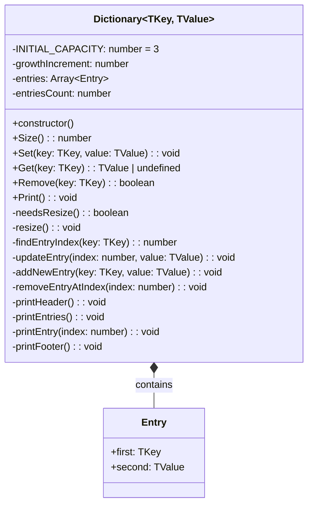

# Dictionary Data Structure

A TypeScript implementation of a Dictionary (key-value pair) data structure using a dynamic array to store entries.

## Class Diagram



## Features

- **Generic Type Support**: Works with any key-value pair types (`TKey`, `TValue`)
- **Dynamic Resizing**: Automatically grows when capacity is exceeded
- **Efficient Operations**: O(n) lookup, insertion, and deletion
- **Memory Management**: Uses array-based storage with controlled growth

## Public Methods

| Method            | Description                                     | Return Type           |
| ----------------- | ----------------------------------------------- | --------------------- |
| `Size()`          | Returns the number of entries in the dictionary | `number`              |
| `Set(key, value)` | Adds or updates a key-value pair                | `void`                |
| `Get(key)`        | Retrieves the value for a given key             | `TValue \| undefined` |
| `Remove(key)`     | Removes a key-value pair from the dictionary    | `boolean`             |
| `Print()`         | Displays all entries in the dictionary          | `void`                |

## Private Methods

| Method                                                             | Description                               | Purpose             |
| ------------------------------------------------------------------ | ----------------------------------------- | ------------------- |
| `needsResize()`                                                    | Checks if the dictionary needs to grow    | Capacity management |
| `resize()`                                                         | Increases the internal array capacity     | Memory expansion    |
| `findEntryIndex(key)`                                              | Locates the index of a key in the array   | Key lookup          |
| `updateEntry(index, value)`                                        | Updates an existing entry's value         | Data modification   |
| `addNewEntry(key, value)`                                          | Adds a new key-value pair                 | Data insertion      |
| `removeEntryAtIndex(index)`                                        | Removes entry by swapping with last entry | Data deletion       |
| `printHeader()`, `printEntries()`, `printEntry()`, `printFooter()` | Console output formatting                 | Display utilities   |

## Internal Structure

- **Initial Capacity**: 3 entries
- **Growth Strategy**: Linear growth by `INITIAL_CAPACITY` (3) on each resize
- **Storage**: Array of objects with `first` (key) and `second` (value) properties
- **Deletion Strategy**: Swap-and-pop (moves last entry to deleted position)

## Usage Example

```typescript
import { Dictionary } from "./Dictionary";

// Create a new dictionary
const dict = new Dictionary<string, number>();

// Add entries
dict.Set("apple", 5);
dict.Set("banana", 3);
dict.Set("orange", 8);

// Retrieve values
console.log(dict.Get("apple")); // Output: 5

// Check size
console.log(dict.Size()); // Output: 3

// Remove entry
dict.Remove("banana");
console.log(dict.Size()); // Output: 2

// Print all entries
dict.Print();
```

## Time Complexity

| Operation | Average Case | Worst Case |
| --------- | ------------ | ---------- |
| Set       | O(n)         | O(n)       |
| Get       | O(n)         | O(n)       |
| Remove    | O(n)         | O(n)       |
| Size      | O(1)         | O(1)       |

_Note: This implementation uses linear search, so lookup operations are O(n). For better performance with large datasets, consider using a hash-based approach._
