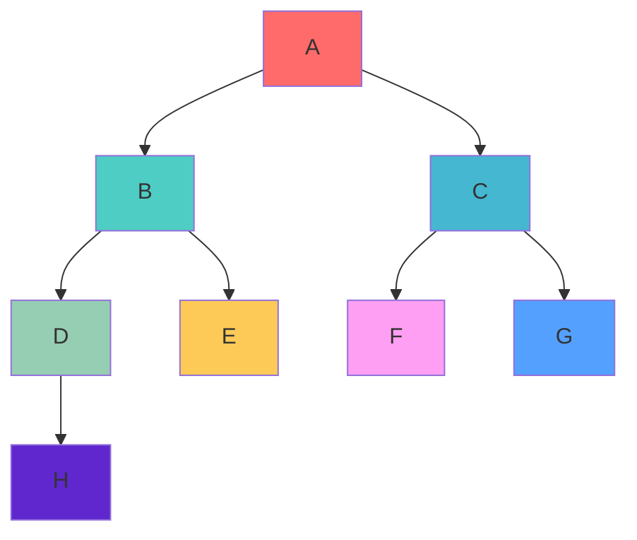

# Binary Tree Implementation in TypeScript

## 📋 Table of Contents

- [Overview](#overview)
- [What is a Binary Tree?](#what-is-a-binary-tree)
- [Implementation Details](#implementation-details)
- [Tree Traversal Methods](#tree-traversal-methods)
- [Backend Development Applications](#backend-development-applications)
- [Code Structure](#code-structure)
- [Usage Examples](#usage-examples)
- [Performance Analysis](#performance-analysis)
- [Real-World Use Cases](#real-world-use-cases)

## 🌳 Overview

This project implements a **Binary Tree** data structure in TypeScript. A binary tree is a fundamental data structure where each node has at most two children, referred to as the left child and right child.

## 🔍 What is a Binary Tree?

A binary tree is a hierarchical data structure consisting of nodes, where:

- Each node contains data and references to its children
- Each node has at most two children (left and right)
- The topmost node is called the **root**
- Nodes with no children are called **leaves**

### Visual Representation

```
        A
       / \
      B   C
     / \ / \
    D  E F  G
   /
  H
```

## 🛠 Implementation Details

### Core Components

#### 1. TreeNode Class

```typescript
class TreeNode<T> {
  data: T;
  left: TreeNode<T> | null = null;
  right: TreeNode<T> | null = null;

  constructor(data: T) {
    this.data = data;
  }
}
```

**Purpose**: Represents individual nodes in the tree

- `data`: Stores the actual value
- `left`: Reference to left child
- `right`: Reference to right child

#### 2. Queue Helper Class

```typescript
export class Queue<T> {
  private dataList: T[] = [];

  enqueue(data: T): void {
    /* Add to end */
  }
  dequeue(): T | undefined {
    /* Remove from front */
  }
  hasData(): boolean {
    /* Check if queue has elements */
  }
}
```

**Purpose**: Used for level-order insertion (breadth-first approach)

#### 3. BinaryTree Class

The main class that manages tree operations:

```typescript
export class BinaryTree<T> {
  private root: TreeNode<T> | null = null;

  // Core operations
  insert(data: T): void;
  height(): number;
  preOrder(): void;
  inOrder(): void;
  postOrder(): void;
  print(): void;
}
```

## 🔄 Tree Traversal Methods

### 1. Pre-Order Traversal (Root → Left → Right)

```
Process: A → B → D → H → E → C → F → G
```

**Algorithm**:

1. Visit the root node
2. Traverse the left subtree
3. Traverse the right subtree

**Use Case**: Used for copying/cloning trees, prefix expression evaluation

### 2. In-Order Traversal (Left → Root → Right)

```
Process: H → D → B → E → A → F → C → G
```

**Algorithm**:

1. Traverse the left subtree
2. Visit the root node
3. Traverse the right subtree

**Use Case**: For Binary Search Trees, gives sorted order

### 3. Post-Order Traversal (Left → Right → Root)

```
Process: H → D → E → B → F → G → C → A
```

**Algorithm**:

1. Traverse the left subtree
2. Traverse the right subtree
3. Visit the root node

**Use Case**: Used for deleting trees, postfix expression evaluation

### Traversal Visualization



## 🖥️ Backend Development Applications

### 1. **Database Systems**

- **B-Trees**: Used in database indexing (MySQL, PostgreSQL)
- **Query Optimization**: Expression trees for SQL parsing
- **Storage**: Hierarchical data storage

```sql
-- Example: Organizational hierarchy
SELECT employee_name
FROM employees
WHERE manager_id IN (
  SELECT employee_id
  FROM employees
  WHERE department = 'Engineering'
);
```

### 2. **File Systems**

- **Directory Structure**: Folders and subfolders
- **Path Resolution**: Navigating file paths
- **Permissions**: Inheritance of access rights

```
/root
├── home/
│   ├── user1/
│   │   ├── documents/
│   │   └── downloads/
│   └── user2/
└── var/
    ├── log/
    └── www/
```

### 3. **Decision Trees & AI**

- **Machine Learning**: Classification algorithms
- **Rule Engines**: Business logic processing
- **Game AI**: Decision making in games

```typescript
// Example: Simple decision tree for user authentication
interface AuthDecision {
  hasValidToken: boolean;
  isExpired: boolean;
  hasPermission: boolean;
}
```

### 4. **Parsing & Compilers**

- **Abstract Syntax Trees (AST)**: Code parsing
- **Expression Evaluation**: Mathematical expressions
- **Template Engines**: HTML/Template processing

```javascript
// Expression: (a + b) * c
//     *
//    / \
//   +   c
//  / \
// a   b
```

### 5. **API Design & Routing**

- **URL Routing**: Hierarchical route matching
- **Middleware Trees**: Request processing pipelines
- **Service Discovery**: Microservice organization

```typescript
// Express.js route tree example
app.use("/api", apiRouter);
app.use("/api/users", userRouter);
app.use("/api/users/:id", userDetailRouter);
```

## 📁 Code Structure

```
10-binary-Tree/
├── binaryTree.ts      # Main binary tree implementation
├── queue.ts           # Helper queue for level-order operations
├── index.ts           # Demo/example usage
├── tsconfig.json      # TypeScript configuration
└── README.md          # This documentation
```

## 💻 Usage Examples

### Basic Usage

```typescript
import { BinaryTree } from "./binaryTree";

// Create a new binary tree
const tree = new BinaryTree<string>();

// Insert elements (level-order insertion)
tree.insert("A");
tree.insert("B");
tree.insert("C");
tree.insert("D");

// Display tree information
console.log(`Tree height: ${tree.height()}`);
tree.print(); // Visual representation

// Perform traversals
tree.preOrder(); // A -> B -> D -> C
tree.inOrder(); // D -> B -> A -> C
tree.postOrder(); // D -> B -> C -> A
```

### Backend API Example

```typescript
// Example: Category tree for e-commerce
interface Category {
  id: string;
  name: string;
  parentId?: string;
}

class CategoryTree {
  private tree = new BinaryTree<Category>();

  addCategory(category: Category): void {
    this.tree.insert(category);
  }

  getCategoryHierarchy(): void {
    this.tree.print();
  }
}
```

## ⚡ Performance Analysis

### Time Complexity

| Operation | Average Case | Worst Case |
| --------- | ------------ | ---------- |
| Insert    | O(log n)     | O(n)       |
| Search    | O(log n)     | O(n)       |
| Delete    | O(log n)     | O(n)       |
| Traversal | O(n)         | O(n)       |

### Space Complexity

- **Storage**: O(n) for n nodes
- **Traversal**: O(h) where h is height (recursion stack)

### When to Use Binary Trees

✅ **Good for:**

- Hierarchical data representation
- Fast searching (when balanced)
- Expression parsing
- Decision making processes

❌ **Not ideal for:**

- Simple list operations
- Frequent insertions at specific positions
- When tree becomes heavily unbalanced

## 🌍 Real-World Use Cases

### 1. **Content Management Systems (CMS)**

```typescript
// Page hierarchy in a CMS
interface Page {
  id: string;
  title: string;
  slug: string;
  content: string;
}

// Structure: Home → About → Team → John Doe
```

### 2. **Organizational Charts**

```typescript
interface Employee {
  id: string;
  name: string;
  position: string;
  managerId?: string;
}
```

### 3. **Menu Systems**

```typescript
interface MenuItem {
  id: string;
  label: string;
  url: string;
  children?: MenuItem[];
}
```

### 4. **Comment Threading**

```typescript
interface Comment {
  id: string;
  content: string;
  authorId: string;
  parentCommentId?: string;
}
```

## 🔧 Running the Code

1. **Prerequisites**:

   ```bash
   # Install Node.js and npm
   npm install -g typescript ts-node
   ```

2. **Install Dependencies** (optional):

   ```bash
   npm install @types/node
   ```

3. **Compile TypeScript**:

   ```bash
   tsc
   ```

4. **Run the example**:
   ```bash
   ts-node index.ts
   # or after compilation:
   node dist/index.js
   ```

## 🚀 Advanced Topics

### Binary Search Trees (BST)

An extension where left child < parent < right child:

```typescript
// BST insertion maintains order
insert(data: T): void {
  if (data < currentNode.data) {
    // Go left
  } else {
    // Go right
  }
}
```

### Self-Balancing Trees

- **AVL Trees**: Height-balanced
- **Red-Black Trees**: Used in databases
- **B-Trees**: Used in file systems

### Tree Variations in Backend

- **Trie**: For autocomplete features
- **Segment Trees**: For range queries
- **Fenwick Trees**: For cumulative frequency

## 📚 Learning Resources

- **Books**: "Introduction to Algorithms" by CLRS
- **Online**: LeetCode tree problems
- **Practice**: Implement BST, AVL, and Red-Black trees

---

**Happy Learning! 🌟**

This implementation provides a solid foundation for understanding binary trees and their applications in backend development. Try modifying the code to implement additional features like search, delete, or balancing operations!
