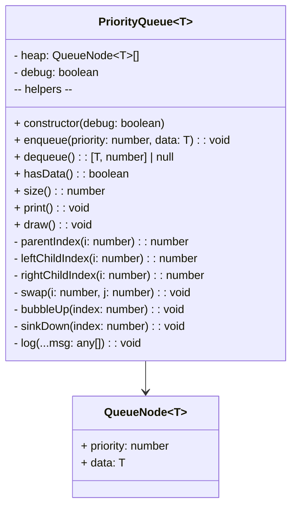

# Priority Queue (Min-Heap) — From Scratch

This project implements a generic Priority Queue in TypeScript using a binary heap stored in an array. It’s designed to be easy to read, extend, and debug, with a focus on learning how a priority queue works under the hood.

- Source files:
  - `PriorityQueue.ts` — the implementation
  - `index.ts` — a tiny demo/runner

## Why a Priority Queue?

A priority queue returns elements by priority, not by insertion order. Common use cases include:

- Dijkstra’s shortest path, A\* search
- Task scheduling and rate-limiting
- Simulation event queues
- Top-K problems and streaming aggregations

We implement a min-priority queue: smaller numeric priorities are dequeued first.

## From Scratch: Design and Data Structure

We want the following core operations:

- enqueue(priority: number, data: T) — O(log n)
- dequeue(): [T, number] | null — O(log n)
- size(): number — O(1)
- hasData(): boolean — O(1)

To achieve logarithmic performance, we use a binary heap backed by a flat array.

- Invariant: every node’s priority ≤ its children’s priorities (min-heap).
- Storage: array `heap: QueueNode<T>[]`, where `QueueNode` is `{ priority: number; data: T }`.
- Index math for node at index i:
  - parent: `(i - 1) // 2`
  - left child: `2*i + 1`
  - right child: `2*i + 2`

On enqueue, we push to the end then bubble up; on dequeue, we remove the root, move the last element to the root, and sink it down.

## Class Diagram



## Files and API

- `PriorityQueue.ts`

  - `enqueue(priority: number, data: T): void`
    - Adds an item with the given priority.
  - `dequeue(): [T, number] | null`
    - Removes and returns the item with the smallest priority; returns `null` if empty.
  - `hasData(): boolean` and `size(): number`
  - `print(): void`
    - Prints a flat representation of the heap array.
  - `draw(): void`
    - Prints the heap by levels to help visualize the tree.
  - Constructor accepts `debug: boolean` to turn on verbose logs of swaps and operations.

- `index.ts` shows a simple usage example and prints the dequeue order.

## Step-by-Step: How the Algorithms Work

### Enqueue

1. Push `{priority, data}` to the end of the array.
2. Bubble up: while the node’s priority is less than its parent’s, swap with the parent.
3. Stop when at root or parent priority is ≤ the node’s priority.

Notes:

- Ties (equal priorities): the current implementation uses `>=` to stop the bubble-up when equal, so items with the same priority do not pass each other during bubble-up. However, the structure is not strictly stable overall (see edge cases), especially after multiple sinkDown operations.

### Dequeue

1. If empty, return `null`.
2. Save the root as the result.
3. Pop the last element; if the heap isn’t empty after popping, move that element to the root and sink it down.
4. Sink down: repeatedly swap the node with the smallest child that has a strictly smaller priority until the heap property is restored.

### Bubble Up

- While `priority(child) < priority(parent)`:
  - Swap child and parent.
  - Move to the parent index and repeat.

### Sink Down

- Compare node with its children.
- Choose the smallest child (by priority).
- If `priority(child) < priority(node)`, swap and continue from the child; else stop.

## Complexity

- enqueue: O(log n)
- dequeue: O(log n)
- size/hasData/peek-root (if added): O(1)
- Memory: O(n)

## Usage Example

`index.ts` demonstrates the API:

```ts
import PriorityQueue from "./PriorityQueue";

const queue = new PriorityQueue<number>(true); // debug=true

queue.enqueue(5, 24);
queue.enqueue(5, 32);
queue.enqueue(3, 16);
queue.enqueue(3, 45);
queue.enqueue(1, 20);
queue.enqueue(1, 53);
queue.enqueue(2, 14);
queue.enqueue(2, 27);

queue.print();
queue.draw();

console.log("\n=== Dequeue Sequence ===");
while (queue.hasData()) {
  const result = queue.dequeue();
  if (result) console.log(`${result[0]} [${result[1]}]`);
}
```

Expected behavior:

- Items are dequeued in ascending priority order: all priority 1 items first, then 2, 3, 5, etc.
- For equal priorities, relative order is usually preserved on insertion, but not guaranteed across all operations (not strictly stable).

## Heap Visualization

- `print()` shows the flat array (root at index 0).
- `draw()` prints by levels (breadth-first). Each node is shown as `data[priority]`.

Example `draw()` output looks like:

```
=== Heap Visualization ===
20[1]
14[2]  53[1]
16[3]  27[2]  32[5]  45[3]
```

(Your output will vary depending on enqueue order and intermediate swaps.)

## Edge Cases and Gotchas

- Empty dequeue: returns `null` (and logs a debug message if `debug=true`).
- Equal priorities:
  - Bubble-up stops on `>=`, so equal-priority children do not move above parents during bubble-up.
  - Sink-down compares using `<` for children vs current node. Stability across many operations is not guaranteed.
- Priority type: numbers only. Avoid `NaN` as a priority (comparisons with `NaN` are always false), and use finite numbers. Negative priorities are fine.
- Data type `T`: fully generic; the queue doesn’t inspect it.

## How to Run (Windows PowerShell)

Here are two quick paths. Pick one.

### Option A: Run with ts-node (no build output)

```powershell
# in folder: 14-priority-queue
npm init -y
npm install --save-dev typescript ts-node
npx ts-node index.ts
```

### Option B: Compile with TypeScript, then run with Node

```powershell
# in folder: 14-priority-queue
npm init -y
npm install --save-dev typescript
npx tsc --init
# compile to default outDir (same folder) or update tsconfig first
npx tsc
# run compiled JS (paths depend on your tsconfig settings)
node index.js
```

If you prefer not to create a full tsconfig yet, you can compile just the entry:

```powershell
npx tsc --target ES2019 --module commonjs index.ts
node index.js
```

## Implementation Choices (and rationale)

- Binary heap via array: simple, cache-friendly, minimal overhead.
- `debug` flag toggles detailed logs for learning/diagnostics.
- `draw()` offers a quick mental model of the tree structure.
- Generic `T` payload with numeric `priority` keeps the core focused and clear.

## What Could Be Improved (Senior Plan)

Low-risk additions that make this more practical and flexible:

- API completeness
  - `peek(): [T, number] | null` — look at the min without removing it.
  - `isEmpty(): boolean` — alias for `!hasData()`.
  - `clear(): void` — remove all items.
  - `toArray(): Array<[T, number]>` — snapshot for inspection/testing.
- Custom comparator
  - Allow passing a comparator `(a: QueueNode<T>, b: QueueNode<T>) => number` to support max-heaps or domain-specific ordering without changing internals.
- Build-heap and bulk ops
  - `from(items: Array<[number, T]>): PriorityQueue<T>` or constructor overload to build in O(n) using Floyd’s heapify.
  - `enqueueAll(iterable)` for efficient batch loads.
- Priority updates
  - `decreaseKey(handle, newPriority)` or `changePriority(predicate, newPriority)` — useful for graph algorithms; requires indexing or handles to find nodes efficiently.
- Stability guarantees (optional)
  - If strict stability is desired, store a monotonically increasing `seq` and compare `(priority, seq)` so equals preserve insertion order.
- Testing and tooling
  - Add a tiny test harness (e.g., Vitest/Jest) and property tests to validate the heap invariant after random sequences of operations.

These improvements keep the learning value while making the queue production-ready over time.

## Quick Contract

- Input
  - `enqueue(priority: number, data: T)` — priority must be a finite number.
- Output
  - `dequeue()` returns `[data, priority]` or `null` if empty.
- Behavior
  - Min-heap: smaller priorities come out first.
- Errors
  - No throws under normal use; empty dequeue is `null`.

## References

- CLRS — Introduction to Algorithms: Heaps and Priority Queues
- Binary heap properties and Floyd’s build-heap

---

If you want, I can add `peek`, `isEmpty`, and a comparator in a small follow-up to make the API more complete without changing existing behavior.
