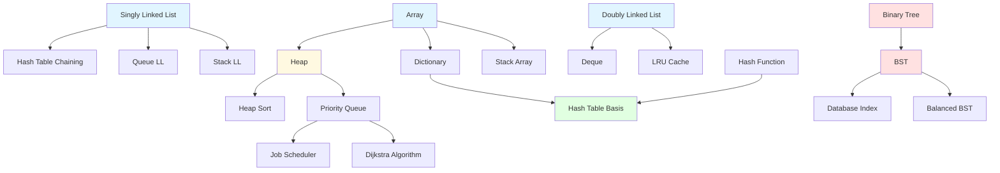

# 🗂️ Data Structures from Scratch - Complete Guide

> **A comprehensive TypeScript implementation of fundamental data structures with real-world backend development applications**

[](https://www.typescriptlang.org/)
[](LICENSE)

---

## 📚 Table of Contents

- [Overview](#-overview)
- [Data Structures Implemented](#-data-structures-implemented)
- [Project Structure](#-project-structure)
- [Detailed Data Structure Guide](#-detailed-data-structure-guide)
  - [1. Array Implementation](#1-array-implementation)
  - [2. Singly Linked List](#2-singly-linked-list)
  - [3. Doubly Linked List](#3-doubly-linked-list)
  - [4. Stack (Linked List)](#4-stack-with-linked-list)
  - [5. Stack (Array)](#5-stack-with-array)
  - [6. Queue (Linked List)](#6-queue-with-linked-list)
  - [7. Dictionary (Key-Value Pairs)](#7-dictionary-key-value-pairs)
  - [8. Hash Functions (FNV-1a)](#8-hash-functions-fnv-1a)
  - [9. Hash Table](#9-hash-table)
  - [10. Binary Tree](#10-binary-tree)
  - [11. Binary Search Tree (BST)](#11-binary-search-tree-bst)
  - [12. Balanced Binary Search Tree](#12-balanced-binary-search-tree)
  - [13. Heap (Min-Heap)](#13-heap-min-heap)
  - [14. Priority Queue](#14-priority-queue)
- [Backend Development Use Cases](#-backend-development-use-cases)
- [Complexity Analysis Summary](#-complexity-analysis-summary)
- [Data Structure Relationships](#-data-structure-relationships)
- [Getting Started](#-getting-started)
- [Learning Path](#-learning-path)

---

## 🎯 Overview

This repository contains **from-scratch implementations** of essential data structures in TypeScript. Each implementation is:

- ✅ **Production-Quality**: Clean, type-safe code with proper error handling
- ✅ **Educationally Focused**: Extensive comments explaining the "why" behind each decision
- ✅ **Backend-Oriented**: Real-world use cases from web development, databases, and distributed systems
- ✅ **Performance-Aware**: Big-O analysis for all operations

**Target Audience**: Backend developers, full-stack engineers, and computer science students who want to understand how data structures work under the hood and when to use them in production systems.

---

## 🧰 Data Structures Implemented

| #   | Data Structure             | Primary Use Case                         | Time Complexity (avg)            |
| --- | -------------------------- | ---------------------------------------- | -------------------------------- |
| 1   | **Array**                  | Sequential storage, indexing             | O(1) access, O(n) insert/delete  |
| 2   | **Singly Linked List**     | Dynamic lists, insertion-heavy workloads | O(1) insert at head, O(n) search |
| 3   | **Doubly Linked List**     | LRU cache, browser history               | O(1) insert/delete at ends       |
| 4-5 | **Stack**                  | Function call stack, undo/redo           | O(1) push/pop                    |
| 6   | **Queue**                  | Task scheduling, BFS                     | O(1) enqueue/dequeue             |
| 7   | **Dictionary**             | Simple key-value storage                 | O(n) lookup (array-based)        |
| 8   | **Hash Function (FNV-1a)** | Hashing, checksums                       | O(n) where n = input size        |
| 9   | **Hash Table**             | Fast lookups, caching                    | O(1) average, O(n) worst         |
| 10  | **Binary Tree**            | Hierarchical data                        | O(log n) to O(n)                 |
| 11  | **Binary Search Tree**     | Sorted data, range queries               | O(log n) average, O(n) worst     |
| 12  | **Balanced BST**           | Database indexes                         | O(log n) guaranteed              |
| 13  | **Heap**                   | Priority operations                      | O(log n) insert/delete           |
| 14  | **Priority Queue**         | Job scheduling, Dijkstra's algorithm     | O(log n) enqueue/dequeue         |

---

## 📁 Project Structure

```
data-structures-from-scratch/
├── 01-Array-Implementation/
│   ├── array.ts                    # Manual array resizing & access
│   ├── index.ts                    # Demo & usage
│   └── README.md
│
├── 02-Singly Linked List/
│   ├── singleLinkedList.ts         # Node-based list implementation
│   └── index.ts
│
├── 03-Doubley Linked List/
│   ├── doubleyLinkedList.ts        # Bidirectional navigation
│   └── index.ts
│
├── 04-stack with Linked List/
│   ├── stack.ts                    # LIFO using linked list
│   ├── linkedList.ts               # Backing data structure
│   └── README.md
│
├── 05-stack with array/
│   ├── stack.ts                    # LIFO using array
│   └── README.md
│
├── 06-Queue with Linked List/
│   ├── queue.ts                    # FIFO implementation
│   ├── linkedList.ts
│   └── README.md
│
├── 07-keyValuePair-Dictionary/
│   ├── Dictionary.ts               # Simple key-value store
│   ├── main.ts
│   └── README.md
│
├── 08-FNV-1a-Implementation/
│   ├── FNV-1A.ts                   # Fast hash function
│   ├── index.ts
│   └── README.md
│
├── 09-implement-hashTable/
│   ├── index.ts                    # Hash table with collision handling
│   └── README.md
│
├── 10-binary-Tree/
│   ├── binaryTree.ts               # Basic tree with traversals
│   ├── queue.ts
│   └── README.md
│
├── 11-binary-Search-Tree/
│   ├── binarySearchTree.ts         # Ordered binary tree
│   ├── demo.ts
│   └── readme.md
│
├── 12-balanced-search-tree/
│   ├── BinaryTree.ts               # Self-balancing tree
│   ├── README_COMPLETE_CODE_EXPLAINED.md
│   └── README_INSERT_EXPLAINED.md
│
├── 13-head implementation/
│   ├── heap.ts                     # Min-heap implementation
│   ├── index.ts
│   └── README.md
│
└── 14-priority-queue/
    ├── PriorityQueue.ts            # Heap-based priority queue
    ├── index.ts
    └── README.md
```

---

## 📖 Detailed Data Structure Guide

### 1. Array Implementation

#### 🔍 What It Is

A custom array implementation that manually manages memory resizing, simulating how arrays work at the low level (like C++ vectors or Java ArrayLists).

#### 💡 Key Concepts

```typescript
class ourArray<T> {
  // Resize array to new size (grow or shrink)
  public Resize(source: T[], newSize: number): (T | undefined)[];

  // Get element at specific index with bounds checking
  public getAt(source: T[], index: number): undefined | T;
}
```

#### 🎯 Backend Use Cases

- **Dynamic Array Resizing**: Understanding how `ArrayList` (Java) or `std::vector` (C++) works
- **Database Page Buffers**: Managing fixed-size memory blocks that need to grow
- **Memory Pool Management**: Pre-allocating and resizing buffers in high-performance systems

#### ⚡ Complexity

| Operation | Time Complexity | Space Complexity |
| --------- | --------------- | ---------------- |
| Access    | O(1)            | O(1)             |
| Resize    | O(n)            | O(n)             |
| Get At    | O(1)            | O(1)             |

#### 🔗 Relationships

- **Foundation for**: Stack (array-based), Dynamic arrays in other languages
- **Alternative to**: Linked lists (when random access is critical)

---

### 2. Singly Linked List

#### 🔍 What It Is

A linear data structure where each node contains data and a reference to the next node. No contiguous memory required.

#### 💡 Key Concepts

```typescript
class ListNode<T> {
  data: T;
  next: ListNode<T> | null;
}

class LinkedList<T> {
  insertAtHead(data: T): void; // O(1)
  insertAtTail(data: T): void; // O(n)
  insertAtPosition(data: T, pos: number): boolean; // O(n)
  delete(data: T): boolean; // O(n)
  search(data: T): boolean; // O(n)
}
```

#### 🎯 Backend Use Cases

1. **Undo/Redo Functionality**

   ```typescript
   // Text editor history
   interface Edit {
     type: "insert" | "delete";
     position: number;
     content: string;
   }
   const history = new LinkedList<Edit>();
   ```

2. **Music Playlist Management**

   - Next/previous song navigation
   - Dynamic insertion/removal of songs

3. **Blockchain Structure**

   - Each block points to the previous block
   - Natural fit for linked list structure

4. **Implementation of Other Structures**
   - Used internally in stacks, queues, and hash table chaining

#### ⚡ Complexity

| Operation      | Time Complexity | Notes                     |
| -------------- | --------------- | ------------------------- |
| Insert at head | O(1)            | Constant time             |
| Insert at tail | O(n)            | Must traverse entire list |
| Delete         | O(n)            | Search + deletion         |
| Search         | O(n)            | Linear scan required      |

#### 🔗 Relationships

- **Building block for**: Stack, Queue, Hash Table (chaining)
- **Improved by**: Doubly Linked List (bidirectional traversal)

---

### 3. Doubly Linked List

#### 🔍 What It Is

An enhanced linked list where each node has references to both the next AND previous nodes, enabling bidirectional traversal.

#### 💡 Key Concepts

```typescript
class DoublyListNode<T> {
  data: T;
  prev: DoublyListNode<T> | null;
  next: DoublyListNode<T> | null;
}

class DoublyLinkedList<T> {
  insertAtHead(data: T): void; // O(1)
  insertAtTail(data: T): void; // O(1) - improved!
  deleteAtHead(): boolean; // O(1)
  deleteAtTail(): boolean; // O(1) - improved!
  reverse(): void; // O(n) in-place
}
```

#### 🎯 Backend Use Cases

1. **LRU (Least Recently Used) Cache**

   ```typescript
   // Redis-like cache implementation
   class LRUCache<K, V> {
     private map: Map<K, Node<K, V>>;
     private list: DoublyLinkedList<{ key: K; value: V }>;

     get(key: K): V | undefined {
       // Move to head (most recently used)
       // O(1) operation with doubly linked list!
     }
   }
   ```

2. **Browser History (Back/Forward Navigation)**

   - Efficient backward and forward traversal
   - O(1) insertion when visiting new pages

3. **Text Editor Buffer**

   - Cursor movement in both directions
   - Line-based editing operations

4. **Task Scheduler with Priority**
   - Move tasks up/down in queue
   - Remove completed tasks from middle

#### ⚡ Complexity

| Operation         | Time Complexity | Advantage Over Singly   |
| ----------------- | --------------- | ----------------------- |
| Insert at head    | O(1)            | Same                    |
| Insert at tail    | O(1)            | **Improved** (was O(n)) |
| Delete at tail    | O(1)            | **Improved** (was O(n)) |
| Reverse traversal | O(n)            | **New capability**      |

#### 🔗 Relationships

- **Enhances**: Singly Linked List
- **Used in**: LRU Cache, Browser history, Deque implementations
- **Trade-off**: More memory (extra pointer) for better performance

---

### 4. Stack with Linked List

#### 🔍 What It Is

A Last-In-First-Out (LIFO) data structure implemented using a linked list for dynamic sizing.

#### 💡 Key Concepts

```typescript
class StackWithLinkedList<T> {
  push(data: T): void; // Add to top - O(1)
  pop(): T | null; // Remove from top - O(1)
  peek(): T | null; // View top - O(1)
  isEmpty(): boolean; // O(1)
}
```

**Visualization:**

```
Push 10, 20, 30:
    [30]  ← Top (last in, first out)
    [20]
    [10]  ← Bottom

Pop returns: 30, then 20, then 10
```

#### 🎯 Backend Use Cases

1. **Function Call Stack**

   ```typescript
   // JavaScript engine internals
   function recursiveFunction(n: number) {
     if (n === 0) return;
     // Current function pushed to call stack
     recursiveFunction(n - 1);
     // Popped when returning
   }
   ```

2. **Expression Evaluation**

   - Parsing mathematical expressions
   - Postfix/prefix notation conversion
   - Syntax validation (matching parentheses)

3. **Undo/Redo Mechanism**

   ```typescript
   class TextEditor {
     private undoStack = new Stack<Action>();
     private redoStack = new Stack<Action>();

     undo() {
       const action = this.undoStack.pop();
       if (action) {
         action.revert();
         this.redoStack.push(action);
       }
     }
   }
   ```

4. **Backtracking Algorithms**

   - Depth-first search (DFS)
   - Maze solving
   - Sudoku solver

5. **Browser Back Button**
   - Page history management
   - State restoration

#### ⚡ Complexity

| Operation | Time | Space |
| --------- | ---- | ----- |
| Push      | O(1) | O(1)  |
| Pop       | O(1) | O(1)  |
| Peek      | O(1) | O(1)  |
| Space     | -    | O(n)  |

#### 🔗 Relationships

- **Built on**: Linked List (or Array)
- **Used in**: DFS algorithms, Expression parsers, Call stack simulation

---

### 5. Stack with Array

#### 🔍 What It Is

A LIFO stack implemented using a dynamic array instead of a linked list.

#### 💡 Key Concepts

```typescript
class Stack<T> {
  private items: T[] = [];

  push(item: T): void {
    this.items.push(item); // O(1) amortized
  }

  pop(): T {
    if (this.isEmpty()) throw new Error("Stack is empty");
    return this.items.pop()!; // O(1)
  }
}
```

#### 🎯 Backend Use Cases

Same as linked list stack, but with different trade-offs:

**When to Use Array-Based Stack:**

- ✅ Better cache locality (faster in practice)
- ✅ Less memory overhead (no next pointers)
- ✅ Predictable memory layout

**When to Use Linked List Stack:**

- ✅ No resizing overhead
- ✅ True O(1) push (array is amortized)
- ✅ No wasted capacity

#### ⚡ Complexity Comparison

| Operation | Array Stack      | Linked List Stack |
| --------- | ---------------- | ----------------- |
| Push      | O(1) amortized\* | O(1) worst case   |
| Pop       | O(1)             | O(1)              |
| Memory    | Better locality  | More overhead     |

\*Amortized: Occasionally O(n) when resizing, but averages to O(1)

---

### 6. Queue with Linked List

#### 🔍 What It Is

A First-In-First-Out (FIFO) data structure where elements are added at the rear and removed from the front.

#### 💡 Key Concepts

```typescript
class QueueWithLinkedList<T> {
  enqueue(item: T): void; // Add to rear - O(1)
  dequeue(): T | null; // Remove from front - O(1)
  peek(): T | null; // View front - O(1)
}
```

**Visualization:**

```
Enqueue 10, 20, 30:
[10] → [20] → [30]
 ↑              ↑
front         rear

Dequeue order: 10, 20, 30 (FIFO)
```

#### 🎯 Backend Use Cases

1. **Message Queue Systems** (RabbitMQ, AWS SQS, Kafka)

   ```typescript
   interface Message {
     id: string;
     payload: any;
     timestamp: number;
   }

   class MessageQueue {
     private queue = new Queue<Message>();

     publish(msg: Message) {
       this.queue.enqueue(msg);
     }

     consume(): Message | null {
       return this.queue.dequeue();
     }
   }
   ```

2. **Task Scheduling**

   - Background job processing
   - Print job queues
   - Email sending queues

3. **Request Buffering**

   ```typescript
   // Rate limiting / request throttling
   class RequestBuffer {
     private buffer = new Queue<Request>();

     async processRequests() {
       while (this.buffer.hasData()) {
         const req = this.buffer.dequeue();
         await this.handleRequest(req);
         await this.rateLimitDelay();
       }
     }
   }
   ```

4. **Breadth-First Search (BFS)**

   - Graph traversal
   - Finding shortest path
   - Web crawler implementation

5. **Server Request Handling**
   - Connection pools
   - Load balancing
   - Round-robin scheduling

#### ⚡ Complexity

| Operation | Time Complexity |
| --------- | --------------- |
| Enqueue   | O(1)            |
| Dequeue   | O(1)            |
| Peek      | O(1)            |
| Search    | O(n)            |

#### 🔗 Relationships

- **Built on**: Linked List (maintains head and tail pointers)
- **Used in**: BFS, Task schedulers, Message brokers
- **Related to**: Priority Queue (orders by priority instead of arrival time)

---

### 7. Dictionary (Key-Value Pairs)

#### 🔍 What It Is

A simple array-based key-value storage structure with dynamic resizing. This is a **learning implementation** showing how dictionaries work before hashing.

#### 💡 Key Concepts

```typescript
class Dictionary<TKey, TValue> {
  private entries: Array<{ first: TKey; second: TValue }>;

  Set(key: TKey, value: TValue): void; // O(n)
  Get(key: TKey): TValue | undefined; // O(n)
  Remove(key: TKey): boolean; // O(n)
  Size(): number; // O(1)
}
```

**How it works:**

- Stores entries in a dynamic array
- Linear search to find keys
- Grows by 3 slots when full
- Uses swap-with-last for deletion

#### 🎯 Backend Use Cases

**Educational Purpose:**

- Understanding the **need for hashing** (O(n) lookups are slow!)
- Foundation before implementing hash tables

**Not recommended for production** - use Hash Table instead for O(1) lookups.

#### ⚡ Complexity

| Operation | Time Complexity | Why?                           |
| --------- | --------------- | ------------------------------ |
| Set       | O(n)            | Linear search for existing key |
| Get       | O(n)            | Must scan entire array         |
| Remove    | O(n)            | Search + swap-with-last        |
| Resize    | O(n)            | Copy all elements              |

#### 🔗 Relationships

- **Educational step toward**: Hash Table
- **Improved by**: Adding hash function → Hash Table
- **Used in**: Learning, small datasets only

---

### 8. Hash Functions (FNV-1a)

#### 🔍 What It Is

A fast, non-cryptographic hash function that converts arbitrary input into a fixed-size number. **FNV-1a** (Fowler-Noll-Vo) is popular for hash tables.

#### 💡 Key Concepts

```typescript
// 32-bit hash
function fnv1a32(input: string | Uint8Array | number[]): number {
  let hash = FNV1A_32_OFFSET;  // 2166136261
  for (each byte in input) {
    hash ^= byte;               // XOR
    hash *= FNV1A_32_PRIME;     // Multiply by 16777619
  }
  return hash;
}

// 64-bit hash (for larger datasets)
function fnv1a64(input: string): bigint
```

**Example:**

```typescript
fnv1a32("hello"); // → 1335831723
fnv1a32("hello", { asHex: true }); // → "4f9f2cab"
```

#### 🎯 Backend Use Cases

1. **Hash Table Indexing**

   ```typescript
   class HashTable<K, V> {
     private hash(key: K): number {
       const hashValue = fnv1a32(String(key));
       return hashValue % this.buckets.length;
     }
   }
   ```

2. **Cache Keys Generation**

   ```typescript
   // Redis cache key generation
   function generateCacheKey(userId: string, endpoint: string): string {
     const hash = fnv1a32(`${userId}:${endpoint}`, { asHex: true });
     return `cache:${hash}`;
   }
   ```

3. **Consistent Hashing** (Distributed Systems)

   - Shard database queries across servers
   - Load balancing
   - CDN routing

4. **Checksums & Data Integrity**

   ```typescript
   const fileHash = fnv1a64(fileContent);
   // Store hash to detect file modifications
   ```

5. **Bloom Filters**
   - Fast membership testing
   - Used in databases, CDNs

#### 🔑 Properties of FNV-1a

- ✅ **Fast**: Simple XOR and multiply operations
- ✅ **Good distribution**: Minimizes collisions
- ✅ **Deterministic**: Same input → same output
- ✅ **Avalanche effect**: Small input change → completely different hash
- ❌ **NOT cryptographically secure**: Don't use for passwords!

#### ⚡ Complexity

| Operation        | Time Complexity             |
| ---------------- | --------------------------- |
| Hash computation | O(n) where n = input length |

#### 🔗 Relationships

- **Used by**: Hash Table, Bloom Filters, Cache systems
- **Alternative to**: MD5, SHA (slower but cryptographic)
- **Building block for**: Consistent hashing, Checksums

---

### 9. Hash Table

#### 🔍 What It Is

A data structure that provides **O(1) average-case** lookups by using a hash function to map keys to array indices. Handles collisions using **linear probing**.

#### 💡 Key Concepts

```typescript
class HashTable<K, V> {
  private buckets: Array<KeyValuePair<K, V> | null>;

  set(key: K, value: V): void; // O(1) average
  get(key: K): V | undefined; // O(1) average
  size(): number; // O(1)
}
```

**How Collision Resolution Works (Linear Probing):**

```
Hash Table (size 5):
Index:  0    1    2    3    4
      [---][---][---][---][---]

1. Insert "Alice" → hash("Alice") = 2
   [---][---][Alice][---][---]

2. Insert "Bob" → hash("Bob") = 2 (collision!)
   Try index 3 → empty!
   [---][---][Alice][Bob][---]

3. Insert "Charlie" → hash("Charlie") = 2 (collision!)
   Try index 3 (occupied), try 4 → empty!
   [---][---][Alice][Bob][Charlie]
```

**Dynamic Resizing:**
When the table becomes full, it doubles in size and rehashes all entries.

#### 🎯 Backend Use Cases

1. **Database Indexing**

   ```sql
   -- PostgreSQL hash index
   CREATE INDEX users_email_idx ON users USING hash(email);
   ```

   Fast lookups for exact matches (not range queries).

2. **Caching Layer** (Redis, Memcached)

   ```typescript
   class CacheService {
     private cache = new HashTable<string, CachedData>();

     async get(key: string) {
       const cached = this.cache.get(key);
       if (cached && !this.isExpired(cached)) {
         return cached.value; // O(1) cache hit!
       }
       return this.fetchFromDatabase(key);
     }
   }
   ```

3. **Session Management**

   ```typescript
   // Express.js session store
   const sessions = new HashTable<SessionID, UserSession>();

   app.use((req, res, next) => {
     const sessionId = req.cookies.sessionId;
     req.session = sessions.get(sessionId);
     next();
   });
   ```

4. **Request Deduplication**

   ```typescript
   class RequestDeduplicator {
     private inFlight = new HashTable<string, Promise<any>>();

     async request(url: string) {
       if (this.inFlight.get(url)) {
         return this.inFlight.get(url); // Reuse existing request
       }
       const promise = fetch(url);
       this.inFlight.set(url, promise);
       return promise;
     }
   }
   ```

5. **Object Mapping** (ORM/ODM)

   - Entity caching in Hibernate, TypeORM
   - Document lookups in MongoDB drivers

6. **Symbol Tables** (Compilers)
   - Variable name → memory location mapping
   - Function name resolution

#### ⚡ Complexity

| Operation | Average | Worst Case | Notes                             |
| --------- | ------- | ---------- | --------------------------------- |
| Set       | O(1)    | O(n)       | Worst when many collisions        |
| Get       | O(1)    | O(n)       | Fast with good hash function      |
| Delete    | O(1)    | O(n)       | Same as get + removal             |
| Resize    | -       | O(n)       | Happens when load factor exceeded |

**Load Factor**: `count / capacity` (triggers resize at 100% in this implementation)

#### 🔗 Relationships

- **Built on**: Array + Hash Function (FNV-1a)
- **Used in**: Caches, Databases, Language runtimes (JS objects, Python dicts)
- **Collision resolution**: Linear probing (alternatives: chaining, quadratic probing)

---

### 10. Binary Tree

#### 🔍 What It Is

A hierarchical data structure where each node has at most **two children** (left and right). This is a **basic binary tree** (not ordered).

#### 💡 Key Concepts

```typescript
class TreeNode<T> {
  data: T;
  left: TreeNode<T> | null;
  right: TreeNode<T> | null;
}

class BinaryTree<T> {
  insert(data: T): void; // Level-order insertion
  height(): number; // Tree depth
  preOrder(): void; // Root → Left → Right
  inOrder(): void; // Left → Root → Right
  postOrder(): void; // Left → Right → Root
}
```

**Tree Structure Example:**

```
        A
       / \
      B   C
     / \ / \
    D  E F  G
   /
  H
```

**Traversal Orders:**

- **Pre-order**: A → B → D → H → E → C → F → G
- **In-order**: H → D → B → E → A → F → C → G
- **Post-order**: H → D → E → B → F → G → C → A

#### 🎯 Backend Use Cases

1. **File System Structure**

   ```
   /root
   ├── home/
   │   ├── user1/
   │   └── user2/
   └── var/
       ├── log/
       └── cache/
   ```

   Each directory is a node with children.

2. **DOM (Document Object Model)**

   ```html
   <html>
     <body>
       <div>
         <p>Text</p>
       </div>
     </body>
   </html>
   ```

   HTML parsed into a tree structure.

3. **Expression Trees** (Compilers)

   ```
   Expression: (3 + 5) * 2

       *
      / \
     +   2
    / \
   3   5
   ```

4. **Decision Trees** (ML/AI)

   - Classification algorithms
   - Game AI (Minimax algorithm)

5. **Organizational Hierarchy**
   ```
   CEO
   ├── CTO
   │   ├── Dev Manager
   │   └── QA Manager
   └── CFO
   ```

#### ⚡ Complexity

| Operation            | Average | Worst | Notes                     |
| -------------------- | ------- | ----- | ------------------------- |
| Insert (level-order) | O(n)    | O(n)  | Must find insertion point |
| Search               | O(n)    | O(n)  | No ordering guarantee     |
| Height               | O(n)    | O(n)  | Visit all nodes           |
| Traversal            | O(n)    | O(n)  | Visit each node once      |

#### 🔗 Relationships

- **Specialized by**: Binary Search Tree (adds ordering)
- **Used in**: Parsing, File systems, Decision making
- **Foundation for**: BST, Heap, Expression evaluation

---

### 11. Binary Search Tree (BST)

#### 🔍 What It Is

An **ordered** binary tree where:

- All values in **left subtree** < node value
- All values in **right subtree** ≥ node value
- Both subtrees are also BSTs

#### 💡 Key Concepts

```typescript
class BinarySearchTree<T> {
  insertNode(data: T): void; // O(log n) average
  remove(value: T): boolean; // O(log n) average
  contains(value: T): boolean; // O(log n) average
  min(): T | null; // O(log n) - leftmost
  max(): T | null; // O(log n) - rightmost

  // Traversals
  inOrder(visitor): void; // Gives SORTED order!
  preOrder(visitor): void;
  postOrder(visitor): void;
  levelOrder(visitor): void;
}
```

**BST Structure Example:**

```
Insert: 8, 3, 10, 1, 6, 14

      8
     / \
    3   10
   / \    \
  1   6    14

In-order traversal: 1, 3, 6, 8, 10, 14 (SORTED!)
```

#### 🎯 Backend Use Cases

1. **Database Indexing** (B-Trees, B+ Trees)

   ```sql
   -- PostgreSQL B-Tree index (based on BST concept)
   CREATE INDEX idx_users_age ON users(age);

   -- Range query optimization
   SELECT * FROM users WHERE age BETWEEN 25 AND 35;
   ```

   O(log n) lookup instead of O(n) table scan.

2. **Auto-complete / Search Suggestions**

   ```typescript
   class AutoComplete {
     private trie: BinarySearchTree<string>;

     suggest(prefix: string): string[] {
       // Find all words starting with prefix
       // BST enables efficient range queries
     }
   }
   ```

3. **Priority-Based Scheduling**

   - Process scheduler (by priority)
   - Event timing systems

4. **Range Queries**

   ```typescript
   // Find all products in price range
   findProductsInRange(minPrice: number, maxPrice: number): Product[] {
     // Efficiently traverse BST
   }
   ```

5. **Sorted Data Maintenance**

   - Maintaining leaderboards
   - Real-time analytics (median, percentiles)

6. **File System Indexing**
   ```typescript
   // inode lookups in Unix filesystems
   class InodeTable {
     private tree: BST<number, FileMetadata>;

     getFile(inodeNumber: number): FileMetadata {
       return this.tree.get(inodeNumber); // O(log n)
     }
   }
   ```

#### ⚡ Complexity

| Operation | Average  | Worst Case | Notes                            |
| --------- | -------- | ---------- | -------------------------------- |
| Insert    | O(log n) | O(n)       | Worst if tree becomes skewed     |
| Search    | O(log n) | O(n)       | O(n) if unbalanced (linked list) |
| Delete    | O(log n) | O(n)       | Same as search + restructuring   |
| Min/Max   | O(log n) | O(n)       | Follow left/right to leaf        |
| In-order  | O(n)     | O(n)       | Visit all nodes                  |

**Worst Case Scenario (Skewed Tree):**

```
Insert: 1, 2, 3, 4, 5 (sorted order)

1
 \
  2
   \
    3
     \
      4
       \
        5

This is essentially a linked list! O(n) operations.
```

**Solution**: Use **Balanced BST** (next section)

#### 🔗 Relationships

- **Extends**: Binary Tree (adds ordering property)
- **Improved by**: AVL Tree, Red-Black Tree (self-balancing)
- **Used in**: Database indexes, Search operations, Range queries
- **Related to**: Heap (different ordering property)

---

### 12. Balanced Binary Search Tree

#### 🔍 What It Is

A BST that maintains **balanced height** to guarantee **O(log n)** operations even in worst case. This implementation supports **manual balancing** by rebuilding the tree.

#### 💡 Key Concepts

```typescript
class BinaryTree<T> {
  insert(data: T): void; // O(log n) average
  delete(data: T): void; // O(log n)
  exists(data: T): boolean; // O(log n)
  balance(): void; // O(n) - manual rebalancing
  height(): number; // O(n)
}
```

**Balancing Strategy:**

1. Extract all values via in-order traversal → sorted array
2. Rebuild tree by picking middle element as root
3. Recursively build left and right subtrees

**Example:**

```
BEFORE (Unbalanced):          AFTER balance():
    1                              4
     \                           /   \
      2                         2     6
       \                       / \   / \
        3                     1   3 5   7
         \
          4
           \
            5
             \
              6
               \
                7

Height: 7 (bad!)            Height: 3 (good!)
```

#### 🎯 Backend Use Cases

1. **Production Database Indexes**

   - **PostgreSQL**: Uses B-Tree (self-balancing)
   - **MySQL InnoDB**: Uses B+ Tree
   - Guarantees O(log n) for millions of rows

2. **In-Memory Databases** (Redis Sorted Sets)

   ```bash
   ZADD leaderboard 100 "player1"
   ZADD leaderboard 200 "player2"
   ZRANGE leaderboard 0 10  # Top 10 - O(log n + k)
   ```

   Internally uses skip lists (similar concept to balanced trees).

3. **File System B-Trees**

   - NTFS, ext4 use B-Trees for directory indexing
   - Balanced structure for fast file lookups

4. **Self-Balancing Implementations**
   - **AVL Trees**: Strict balancing (height diff ≤ 1)
   - **Red-Black Trees**: Used in C++ `std::map`, Java `TreeMap`
   - **Splay Trees**: Move frequently accessed to root

#### ⚡ Complexity

| Operation | Balanced | Unbalanced (worst) |
| --------- | -------- | ------------------ |
| Insert    | O(log n) | O(n)               |
| Search    | O(log n) | O(n)               |
| Delete    | O(log n) | O(n)               |
| Balance   | O(n)     | -                  |
| Space     | O(n)     | O(n)               |

**Height Comparison:**

- **Balanced**: Height = O(log n)
- **Unbalanced**: Height = O(n) in worst case

#### 🔗 Relationships

- **Improves**: Binary Search Tree (guarantees performance)
- **Real-world versions**: AVL Tree, Red-Black Tree, B-Tree
- **Used in**: Database engines, Language standard libraries
- **Trade-off**: Extra balancing overhead vs. guaranteed performance

---

### 13. Heap (Min-Heap)

#### 🔍 What It Is

A **complete binary tree** stored as an array where the parent is always **smaller** than its children (min-heap). Used for efficient priority operations.

#### 💡 Key Concepts

```typescript
class Heap<T> {
  private dataList: T[];

  insert(data: T): void; // O(log n) - bubble up
  pop(): T | null; // O(log n) - remove root, heapify down
  size(): number; // O(1)
  print(): void; // Array representation
  draw(): void; // Tree visualization
}
```

**Array Representation:**

```
Array: [1, 3, 2, 7, 5, 8, 9]
Index:  0  1  2  3  4  5  6

Tree structure:
        1
       / \
      3   2
     / \ / \
    7  5 8  9

Parent of index i: (i-1)/2
Left child of i: 2*i + 1
Right child of i: 2*i + 2
```

**Operations:**

1. **Insert (Bubble Up)**:

   ```
   Insert 4 into [1, 3, 2, 7, 5]:

   Step 1: Add to end
   [1, 3, 2, 7, 5, 4]

   Step 2: Compare with parent (2)
   4 > 2, so stop. Done!
   ```

2. **Pop (Heapify Down)**:

   ```
   Pop from [1, 3, 2, 7, 5]:

   Step 1: Remove root (1), move last to root
   [5, 3, 2, 7]

   Step 2: Compare 5 with children (3, 2)
   Swap with smallest child (2)
   [2, 3, 5, 7]

   Step 3: Compare 5 with its new children
   No children, done!
   ```

#### 🎯 Backend Use Cases

1. **Priority Queue Implementation** (see next section)

   - Job schedulers
   - Event-driven simulations

2. **Heap Sort Algorithm**

   ```typescript
   function heapSort(arr: number[]): number[] {
     const heap = new Heap<number>();
     arr.forEach((n) => heap.insert(n));

     const sorted = [];
     while (heap.size() > 0) {
       sorted.push(heap.pop()!); // O(n log n)
     }
     return sorted;
   }
   ```

3. **K Largest/Smallest Elements**

   ```typescript
   // Find K largest elements from stream
   class TopK {
     private heap = new Heap<number>(); // Min-heap of size K

     add(value: number) {
       if (this.heap.size() < K) {
         this.heap.insert(value);
       } else if (value > this.heap.peek()) {
         this.heap.pop();
         this.heap.insert(value);
       }
     }
   }
   ```

4. **Median Calculation** (Two-Heap Approach)

   ```typescript
   class MedianFinder {
     maxHeap = new MaxHeap(); // Lower half
     minHeap = new MinHeap(); // Upper half

     findMedian() {
       // Median is at top of heaps
     }
   }
   ```

5. **Memory Management** (Operating Systems)
   - Free memory block tracking
   - Best-fit allocation

#### ⚡ Complexity

| Operation         | Time Complexity | Space |
| ----------------- | --------------- | ----- |
| Insert            | O(log n)        | O(1)  |
| Pop (extract min) | O(log n)        | O(1)  |
| Peek (view min)   | O(1)            | O(1)  |
| Build heap        | O(n)            | O(n)  |
| Heapify           | O(log n)        | O(1)  |

#### 🔗 Relationships

- **Used in**: Priority Queue, Heap Sort, Graph algorithms (Dijkstra, Prim)
- **Array-based**: No pointers needed (unlike BST)
- **Variants**: Min-heap (smallest at root), Max-heap (largest at root)
- **Not a BST**: Different ordering property

---

### 14. Priority Queue

#### 🔍 What It Is

A queue where elements are dequeued **based on priority** (not insertion order). Implemented using a **min-heap** for efficient operations.

#### 💡 Key Concepts

```typescript
interface QueueNode<T> {
  priority: number;
  data: T;
}

class PriorityQueue<T> {
  private heap: QueueNode<T>[];

  enqueue(priority: number, data: T): void; // O(log n)
  dequeue(): [T, number] | null; // O(log n)
  hasData(): boolean; // O(1)
  size(): number; // O(1)
}
```

**Example:**

```typescript
const pq = new PriorityQueue<string>();

pq.enqueue(5, "Low priority task");
pq.enqueue(1, "Critical task");
pq.enqueue(3, "Medium task");

pq.dequeue(); // Returns "Critical task" (priority 1)
pq.dequeue(); // Returns "Medium task" (priority 3)
pq.dequeue(); // Returns "Low priority task" (priority 5)
```

#### 🎯 Backend Use Cases

1. **Task Scheduling** (Celery, Bull, Sidekiq)

   ```typescript
   enum Priority {
     CRITICAL = 1,
     HIGH = 2,
     NORMAL = 3,
     LOW = 4,
   }

   interface Task {
     id: string;
     execute: () => Promise<void>;
   }

   class TaskScheduler {
     private queue = new PriorityQueue<Task>();

     schedule(task: Task, priority: Priority) {
       this.queue.enqueue(priority, task);
     }

     async processNext() {
       const [task] = this.queue.dequeue();
       await task.execute();
     }
   }
   ```

2. **Dijkstra's Shortest Path Algorithm**

   ```typescript
   function dijkstra(graph: Graph, start: Node): Map<Node, number> {
     const pq = new PriorityQueue<Node>();
     const distances = new Map<Node, number>();

     pq.enqueue(0, start);
     distances.set(start, 0);

     while (pq.hasData()) {
       const [node, dist] = pq.dequeue();

       for (const neighbor of node.neighbors) {
         const newDist = dist + edge.weight;
         if (newDist < distances.get(neighbor)) {
           distances.set(neighbor, newDist);
           pq.enqueue(newDist, neighbor); // Priority = distance
         }
       }
     }

     return distances;
   }
   ```

3. **Event-Driven Simulation**

   ```typescript
   interface Event {
     time: number;
     type: string;
     handler: () => void;
   }

   class EventSimulator {
     private events = new PriorityQueue<Event>();

     schedule(event: Event) {
       this.events.enqueue(event.time, event);
     }

     run() {
       while (this.events.hasData()) {
         const [event] = this.events.dequeue();
         event.handler();
       }
     }
   }
   ```

4. **Load Balancing**

   ```typescript
   class LoadBalancer {
     private servers = new PriorityQueue<Server>();

     route(request: Request): Server {
       const [server, load] = this.servers.dequeue();
       server.handle(request);
       this.servers.enqueue(load + 1, server); // Re-enqueue with new load
       return server;
     }
   }
   ```

5. **A\* Pathfinding** (Games, Maps)

   ```typescript
   function aStar(start: Node, goal: Node): Path {
     const openSet = new PriorityQueue<Node>();
     openSet.enqueue(heuristic(start, goal), start);

     while (openSet.hasData()) {
       const [current] = openSet.dequeue();
       if (current === goal) return reconstructPath();

       // Explore neighbors with priority = f(n) = g(n) + h(n)
     }
   }
   ```

6. **CPU Scheduling** (Operating Systems)
   - Process priority scheduling
   - Real-time task management

#### ⚡ Complexity

| Operation | Time Complexity | Implementation  |
| --------- | --------------- | --------------- |
| Enqueue   | O(log n)        | Heap insertion  |
| Dequeue   | O(log n)        | Heap extraction |
| Peek      | O(1)            | View root       |
| Build     | O(n)            | Heapify array   |

**Comparison with Regular Queue:**

| Operation | Regular Queue | Priority Queue |
| --------- | ------------- | -------------- |
| Enqueue   | O(1)          | O(log n)       |
| Dequeue   | O(1)          | O(log n)       |
| Order     | FIFO          | By priority    |

#### 🔗 Relationships

- **Built on**: Heap (min-heap or max-heap)
- **Enhanced version of**: Queue (adds priority)
- **Used in**: Graph algorithms, Task schedulers, Event systems
- **Alternative implementations**: Binary heap (this), Fibonacci heap, Binomial heap

---

## 🚀 Backend Development Use Cases

### Real-World Application Map

```
┌─────────────────────────────────────────────────────────────┐
│                  BACKEND ARCHITECTURE                        │
├─────────────────────────────────────────────────────────────┤
│                                                              │
│  🌐 HTTP Server (Node.js/Express)                           │
│  ├─ Request Queue ..................... Queue               │
│  ├─ Session Storage .................. Hash Table           │
│  └─ Middleware Stack ................. Stack                │
│                                                              │
│  💾 Database Layer                                           │
│  ├─ B-Tree Indexes ................... Balanced BST         │
│  ├─ Hash Indexes ..................... Hash Table           │
│  ├─ Query Cache ...................... Hash Table + LRU     │
│  └─ Connection Pool .................. Queue                │
│                                                              │
│  📦 Cache Layer (Redis)                                      │
│  ├─ Key-Value Store .................. Hash Table           │
│  ├─ LRU Eviction ..................... Doubly Linked List   │
│  ├─ Sorted Sets ...................... Balanced BST         │
│  └─ Pub/Sub .......................... Queue                │
│                                                              │
│  ⚙️ Background Jobs (Celery/Bull)                           │
│  ├─ Job Queue ........................ Priority Queue       │
│  ├─ Task Scheduling .................. Heap                 │
│  └─ Worker Pool ...................... Queue                │
│                                                              │
│  🔍 Search Engine (Elasticsearch)                            │
│  ├─ Inverted Index ................... Hash Table           │
│  ├─ Autocomplete ..................... Trie (Tree variant)  │
│  └─ Ranking .......................... Heap / Priority Queue│
│                                                              │
│  🗺️ Routing & Load Balancing                                │
│  ├─ Route Matching ................... Trie / BST           │
│  ├─ Consistent Hashing ............... Hash Function        │
│  └─ Server Selection ................. Priority Queue       │
│                                                              │
└─────────────────────────────────────────────────────────────┘
```

### Use Case Decision Matrix

| Requirement                        | Recommended Structure           | Why?                             |
| ---------------------------------- | ------------------------------- | -------------------------------- |
| **Fast exact lookups**             | Hash Table                      | O(1) average                     |
| **Sorted data + range queries**    | BST / Balanced BST              | O(log n) range operations        |
| **FIFO processing**                | Queue                           | Task scheduling, message brokers |
| **LIFO processing**                | Stack                           | Undo/redo, DFS, recursion        |
| **Priority-based processing**      | Priority Queue                  | Job scheduling, graph algorithms |
| **Frequent insert/delete at ends** | Doubly Linked List              | LRU cache, deque                 |
| **Maintain sorted order**          | Heap (for min/max) or BST       | Top-K problems, leaderboards     |
| **Hierarchical data**              | Tree                            | File systems, org charts         |
| **Cache with eviction**            | Hash Table + Doubly Linked List | LRU cache                        |

---

## 📊 Complexity Analysis Summary

### Time Complexity Comparison

| Data Structure         | Access    | Search    | Insert    | Delete    | Space |
| ---------------------- | --------- | --------- | --------- | --------- | ----- |
| **Array**              | O(1)      | O(n)      | O(n)      | O(n)      | O(n)  |
| **Singly Linked List** | O(n)      | O(n)      | O(1)\*    | O(n)      | O(n)  |
| **Doubly Linked List** | O(n)      | O(n)      | O(1)\*    | O(1)\*    | O(n)  |
| **Stack**              | O(n)      | O(n)      | O(1)      | O(1)      | O(n)  |
| **Queue**              | O(n)      | O(n)      | O(1)      | O(1)      | O(n)  |
| **Hash Table**         | -         | O(1)†     | O(1)†     | O(1)†     | O(n)  |
| **Binary Tree**        | O(n)      | O(n)      | O(n)      | O(n)      | O(n)  |
| **BST**                | O(log n)† | O(log n)† | O(log n)† | O(log n)† | O(n)  |
| **Balanced BST**       | O(log n)  | O(log n)  | O(log n)  | O(log n)  | O(n)  |
| **Heap**               | -         | O(n)      | O(log n)  | O(log n)  | O(n)  |
| **Priority Queue**     | -         | O(n)      | O(log n)  | O(log n)  | O(n)  |

_\* At head/tail position_  
_† Average case (worst case can be O(n))_

### Operation-Specific Best Choices

| Operation               | Best Structure     | Complexity   |
| ----------------------- | ------------------ | ------------ |
| **Random access**       | Array              | O(1)         |
| **Search (sorted)**     | Balanced BST       | O(log n)     |
| **Search (unsorted)**   | Hash Table         | O(1) avg     |
| **Insert at beginning** | Linked List        | O(1)         |
| **Insert at end**       | Doubly Linked List | O(1)         |
| **Insert sorted order** | BST                | O(log n)     |
| **Remove min/max**      | Heap               | O(log n)     |
| **Range queries**       | BST                | O(log n + k) |
| **FIFO processing**     | Queue              | O(1)         |
| **LIFO processing**     | Stack              | O(1)         |
| **Priority processing** | Priority Queue     | O(log n)     |

---

## 🔗 Data Structure Relationships

### Dependency Graph



### Evolution Paths

1. **Array → Dynamic Array → Stack/Queue**

   - Adding structure to basic array operations

2. **Linked List → Stack/Queue → Deque**

   - Building specialized access patterns

3. **Array + Hash Function → Dictionary → Hash Table**

   - From linear search to constant-time lookups

4. **Binary Tree → BST → Balanced BST**

   - Adding order, then guaranteeing performance

5. **Heap → Priority Queue → Advanced Algorithms**
   - From structure to application

---

## 🚀 Getting Started

### Prerequisites

```bash
# Install Node.js (v14+)
node --version

# Install TypeScript globally
npm install -g typescript

# Install ts-node for quick execution
npm install -g ts-node
```

### Running Examples

```powershell
# Navigate to any folder
cd "01-Array-Implementation"

# Run with ts-node (quick)
ts-node index.ts

# Or compile and run
tsc index.ts
node index.js
```

### Project Setup

```bash
# Clone the repository
git clone https://github.com/adham-2002/data-structures-from-scratch.git

# Navigate to project
cd data-structures-from-scratch

# Install dependencies (if any)
npm install

# Run specific data structure
cd "11-binary-Search-Tree"
ts-node demo.ts
```

---

## 📚 Learning Path

### Beginner Path (Start Here)

1. ✅ **Array Implementation** - Understand memory and indexing
2. ✅ **Singly Linked List** - Learn pointer-based structures
3. ✅ **Stack** - Master LIFO operations
4. ✅ **Queue** - Master FIFO operations
5. ✅ **Hash Function** - Understand hashing basics

### Intermediate Path

6. ✅ **Doubly Linked List** - Bidirectional navigation
7. ✅ **Dictionary** - Key-value storage (simple)
8. ✅ **Hash Table** - Efficient lookups with collision handling
9. ✅ **Binary Tree** - Introduction to trees
10. ✅ **Binary Search Tree** - Ordered tree operations

### Advanced Path

11. ✅ **Balanced BST** - Guaranteed performance
12. ✅ **Heap** - Priority-based structure
13. ✅ **Priority Queue** - Real-world job scheduling
14. ✅ **Advanced Applications** - LRU Cache, Graph Algorithms

### Learning Tips

- 📖 **Read the README** in each folder for detailed explanations
- 💻 **Run the code** and observe output
- ✏️ **Modify examples** to test your understanding
- 🧪 **Implement new methods** as exercises
- 🔍 **Debug with console.log** to see internal state

---

## 🎓 Additional Resources

### Books

- _Introduction to Algorithms_ (CLRS) - The definitive guide
- _Grokking Algorithms_ - Visual, beginner-friendly
- _The Algorithm Design Manual_ - Practical focus

### Online Courses

- [CS50 - Harvard](https://cs50.harvard.edu/)
- [Algorithms Specialization - Stanford (Coursera)](https://www.coursera.org/specializations/algorithms)
- [Data Structures Easy to Advanced - freeCodeCamp](https://www.youtube.com/watch?v=RBSGKlAvoiM)

### Visualization Tools

- [VisuAlgo](https://visualgo.net/) - Animated data structures
- [Data Structure Visualizations](https://www.cs.usfca.edu/~galles/visualization/Algorithms.html)
- [Algorithm Visualizer](https://algorithm-visualizer.org/)

---

## 🤝 Contributing

Contributions are welcome! If you'd like to:

- Add new data structures
- Improve existing implementations
- Fix bugs or typos
- Add more use case examples

Please open an issue or submit a pull request.

---

## 📄 License

This project is licensed under the MIT License - see the [LICENSE](LICENSE) file for details.

---

## 👨‍💻 Author

**Adham**  
GitHub: [@adham-2002](https://github.com/adham-2002)

---

## 🌟 Final Thoughts

> "Understanding data structures is not just about memorizing operations—it's about recognizing patterns in problems and choosing the right tool for the job."

This repository demonstrates that:

1. **Every data structure solves specific problems**

   - Arrays for random access
   - Trees for hierarchical data
   - Hash tables for fast lookups

2. **Backend development relies heavily on these fundamentals**

   - Databases use B-Trees
   - Caches use hash tables + linked lists
   - Job queues use priority queues

3. **Trade-offs are everywhere**
   - Time vs. Space
   - Simplicity vs. Performance
   - Average case vs. Worst case

**Keep learning, keep building, and remember**: The best way to learn data structures is to **implement them yourself**! 🚀

---

**⭐ If you found this helpful, please star the repository!**
